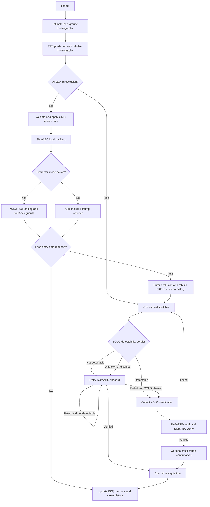

# SiamRAM

<div align="center">

**Robust long-term visual object tracking with occlusion recovery and distractor-aware reacquisition**

[](https://www.python.org/)
[](https://pytorch.org/)
[](https://developer.nvidia.com/cuda-toolkit)
[](LICENSE)

</div>

## Abstract

SiamRAM is a hybrid long-term tracker built around a fast local Siamese tracker
(SiamABC), homography-based Global Motion Compensation (GMC), a center-state
Extended Kalman Filter (EKF), YOLO re-detection, and short/long-term appearance
memory (RAM/DRM). It separates ordinary tracking, distractor handling, and
lost-target recovery into distinct modes so camera motion, temporary occlusion,
and look-alike objects do not all trigger the same response.

The current recovery path is adaptive. A YOLO-detectability probe decides
whether an occluded sequence should rely on SiamABC alone or on multi-frame
YOLO candidate collection plus DRM ranking. Every accepted recovery is verified
by SiamABC before the tracker commits and resumes normal tracking.

## Table of Contents

- [System Architecture](#system-architecture)
- [Current Configuration](#current-configuration)
- [Installation](#installation)
- [Checkpoints](#checkpoints)
- [Quick Start](#quick-start)
- [TensorRT Cache Behavior](#tensorrt-cache-behavior)
- [Training](#training)
- [Project Structure](#project-structure)
- [Authors](#authors)
- [Citation](#citation)

---

## System Architecture

The live tracker is coordinated by
`models/siamram/tracker.py`. Its major collaborators are the camera-motion,
occlusion-recovery, distractor-mode, spike-watcher, motion, and memory modules.



### Normal Tracking

Each frame is prescaled, background motion is estimated, and the EKF predicts
the next target center. Before SiamABC runs, the GMC prior can warp the previous
bbox through the reliable homography and inject that warped bbox as SiamABC's
search starting point. Healthy predictions update the EKF, motion history, and
appearance memory.

The tracker also runs early class/detectability probes and can adapt SiamABC's
dynamic-template cadence to target or camera motion. Low confidence must pass
the configured grace period, hysteresis, and camera-motion guards before it is
treated as a real loss.

### GMC and Motion Model

`CameraMotionSubsystem` estimates background motion between consecutive frames:

- `classic` mode uses grid optical flow plus affine RANSAC and is the default.
- `accurate` mode uses feature tracking plus a full homography, then falls back
  to `classic` if necessary.

A homography is only used as a GMC search prior when it is reliable and passes
translation, scale, rotation, and corner-displacement plausibility checks. The
same camera-motion estimate is also used by the EKF, heavy-motion guards,
loss-cause classification, and camera-compensated recovery-candidate velocity.

`BBoxEKF` tracks `[cx, cy, vx, vy]`; bbox width and height are smoothed
separately. During loss, its prediction drives the held bbox and expanding
search ROI. Out-of-frame recovery pins the search center to the detected exit
edge until the predicted motion points back into the frame.

### Appearance Memory

`AppearanceMemory` contains three identity signals:

- **RAM:** recent high-confidence descriptors admitted only when bbox continuity
  and area consistency pass.
- **DRM:** longer-term descriptors promoted after repeated appearance agreement.
- **Distractor bank:** negative descriptors used to suppress known look-alikes.

The default descriptor backend is OSNet. SiamABC-feature and legacy pixel
descriptor backends are also supported by the tracker configuration.

### Distractor Mode

The optional spike watcher detects camera-compensated, abnormal bbox jumps. A
confirmed jump snaps the tracker back to a stable pre-jump anchor, stores the
switched object as a distractor, and enters distractor mode.

Distractor mode runs YOLO in a focused ROI and ranks candidates using target
appearance, focus IoU/distance, the negative distractor bank, and optional EKF
Mahalanobis gating. Ambiguous evidence is deliberately held instead of causing
an immediate identity switch. The mode includes below-gate motion holds,
overlap motion locks, stable-exit confirmation, and an optional forced handoff
to occlusion recovery when the real target appears lost.

> The current inference config keeps this machinery available under
> `ram_tracker.distractor_mode.spike_reject` and enables spike-triggered
> distractor-mode entry by default.

### Occlusion Recovery

Occlusion entry is not just a low-score branch. The tracker skips likely
corrupted recent history, rebuilds the EKF from clean frames, freezes dynamic
template updates/TTA, classifies the loss cause, and starts the recovery
dispatcher immediately.

Recovery then follows this policy:

1. **Detectability policy:** an early normal-tracking probe determines whether
   YOLO can detect the target. Detectable targets skip the SiamABC-only commit
   path and rely on YOLO+DRM. Targets found not detectable retry SiamABC phase 0
   and skip futile YOLO collection. If no verdict exists, the legacy phase
   sequence is used.
2. **Phase 0, SiamABC fast path:** seed SiamABC inside the growing or edge-pinned
   ROI. Reacquisition requires both the SiamABC score gate and an appearance
   memory/DRM gate.
3. **Phase 1, candidate collection:** collect YOLO boxes and descriptors across
   `cand_collection_frames`, recording camera velocity for motion compensation.
4. **Phase 2, final ranking:** trace candidates across collection frames, rank
   them with RAM/DRM according to policy, augment with motion consistency, and
   verify the top candidates using SiamABC.
5. **Confirmation and commit:** optionally require consecutive confident
   verification frames, then update the EKF, clear recovery/distractor state,
   restore normal tracker updates, and admit the recovered appearance.

The current config uses one collection frame and one confirmation frame, so
both values can be increased without changing the recovery implementation.

For deeper design notes, see
[SIAMRAM_THEORY_AND_ARCHITECTURE.md](docs/SIAMRAM_THEORY_AND_ARCHITECTURE.md)
and the [System Description](docs/system_description.pdf). The source modules
and `config/inference_config_experimental.yaml` are the authoritative behavior.

---

## Current Configuration

The primary inference config is
`config/inference_config_experimental.yaml`. Every leaf below `ram_tracker` is
flattened into a `SiamRAMExperimentTracker` keyword argument; the nesting is for
readability.

Important current defaults:

| Config key | Default | Effect |
|---|---:|---|
| `trt_engine.trt_compile_siamabc` | `true` | Use the TensorRT SiamABC wrapper |
| `trt_engine.backbone_mode` | `dynamic_fp16` | Dynamic-shape FP16 SiamABC backbone |
| `trt_engine.trt_compile_osnet` | `true` | Compile the OSNet descriptor engine |
| `tracker.hanning_window_penalty.enabled` | `true` | Bias SiamABC score-map peaks toward the search center |
| `tracker.hanning_window_penalty.influence` | `1` | Strength of the Hanning/cosine score prior |
| `ram_tracker.camera_motion.core.homography_mode` | `classic` | Fast GMC estimator |
| `ram_tracker.gmc_prior.gmc_prior_enabled` | `true` | Warp the previous bbox into SiamABC's search prior |
| `ram_tracker.distractor_mode.entry.block_distractor_mode_on_camera_motion` | `true` | Suppress false jump-switches during heavy camera motion |
| `ram_tracker.camera_motion.gating.block_occlusion_on_camera_motion` | `false` | Allow low-confidence occlusion entry during heavy motion |
| `ram_tracker.occlusion.detectability_probe.yolo_detectability_enabled` | `true` | Select SiamABC-only versus YOLO+DRM recovery |
| `ram_tracker.occlusion.phase1_collect.cand_collection_frames` | `1` | Number of YOLO collection frames |
| `ram_tracker.occlusion.reacquire_confirm.reacq_confirm_frames` | `1` | Verification frames before committing recovery |
| `ram_tracker.distractor_mode.spike_reject.spike_reject_enabled` | `true` | Spike-triggered distractor entry is on |
| `ram_tracker.yolo.copile_yolo` | `false` | Ultralytics YOLO engine export is off |

---

## Installation

Depending on whether your machine has a GPU, follow one of these guides:

- [CUDA / GPU Installation Guide](docs/install-CUDA.md) — Native Docker, VSCode Devcontainer, or local `uv` with CUDA
- [CPU-only Installation Guide](docs/install-CPU.md) — Native Docker, VSCode Devcontainer, or local `uv` without a GPU

The primary inference config currently enables TensorRT for SiamABC and OSNet,
so the commands below assume a CUDA environment. For CPU inference, set
`trt_engine.trt_compile_siamabc`, `trt_engine.trt_compile_osnet`, and
`trt_engine.osnet_fp16` to `false` in a CPU-specific config.

Throughout this README, every runnable step is shown for all three environments. If you are unsure which one applies to you:

> 💡 **Which environment am I in?**
>
> | How you installed | Your environment |
> |---|---|
> | Ran `poe gpu_setup` or `poe cpu_setup` in a terminal | **Native Docker** |
> | Opened the project via *Dev Containers: Reopen in Container* in VSCode | **VSCode Devcontainer** |
> | Ran `uv sync` directly on your machine | **Local uv** |

---

## Checkpoints

Inference requires two files under `checkpoints/`:

- `inference_checkpoint.pth` — the SiamABC weights.
- `yolo11n.pt` — the YOLO weights.

`SiamABC_init_checkpoint.pth` is additionally available for training from
scratch.

Download all published checkpoints with:

```bash
uv run checkpoints/download_checkpoints.py
```

Or grab them directly from [Google Drive](https://drive.google.com/drive/folders/1BRPhnBnU9CDLU5qQPv-zQeKtqv1HMsl4?usp=drive_link) and place them in `checkpoints/`.

If either required inference checkpoint is missing or corrupt,
`run_inference.py` automatically invokes the downloader before building the
tracker.

---

## Quick Start

`run_inference.py` expects the AIC-4 competition data layout under `data/`:

```
data/
├── metadata/
│   └── contestant_manifest.json
└── <dataset_name>/
    ├── <video_id>/
    │   └── video.mp4
    └── annotations/
        └── <video_id>.txt     # single line: x,y,w,h
```

Paths are resolved against the repository root, even when the command is
launched from elsewhere.

### Full Public Leaderboard Split

Run every `public_lb` entry and write a complete `submission.csv`:

```bash
uv run run_inference.py --run_split public_lb --max_sequences 0
```

`public_lb` and `max_sequences=0` are already the defaults; they are written
explicitly above so a full leaderboard run is unambiguous.

Force the serialized TensorRT engines to rebuild once before the full run:

```bash
uv run run_inference.py \
    --run_split public_lb \
    --max_sequences 0 \
    --rebuild_trt_cache
```

### Useful Runs

```bash
# Fast smoke test: first public-LB sequence only
uv run run_inference.py --run_split public_lb --max_sequences 1

# One manifest video by exact key
uv run run_inference.py --run_split all --video_key dataset1/volleyball

# One video by generated numeric id or exact key, with annotated video output
uv run run_single_video.py 42

# Only selected datasets
uv run run_inference.py --run_split public_lb --datasets dataset1 dataset3

# Train and public-LB manifest entries in one pass
uv run run_inference.py --run_split all

# Write annotated debug videos in addition to bbox text files
uv run run_inference.py --run_split public_lb --output_video
```

### Other Environments

Start a native Docker container once with `poe gpu_up`, then replace the local
`uv run` prefix with `poe gpu_run`:

```bash
poe gpu_run run_inference.py --run_split public_lb --max_sequences 0
```

Inside the VSCode devcontainer, run Python directly:

```bash
python run_inference.py --run_split public_lb --max_sequences 0
```

### Outputs

By default, each sequence writes its bbox text file under:

```text
outputs/SiamRAM/<dataset>/<video_name>/<video_name>.txt
```

`--output_video` writes the annotated video beside that bbox file. At the end
of the run, selected outputs are flattened into `submission.csv`.

`--override_csv` rebuilds the selected split from all matching saved bbox files
under `--outputs_dir`; when some files are missing, it preserves their prior
rows only if the existing submission CSV is available.

### CLI Arguments

Run `uv run run_inference.py --help` for the authoritative live parser.

| Argument | Default | Description |
|---|---|---|
| `--split` | unset | Convenience alias: `test` → `public_lb`; also accepts `train` and `all` |
| `--run_split` | `public_lb` | Run `public_lb`, `train`, `train_csv`, or manifest `all` |
| `--train_csv_path` | `data/train_dataframe.csv` | CSV used by `--run_split train_csv` |
| `--data_dir` | `data` | Root containing videos and annotations |
| `--max_sequences` | `0` | Sequence cap; `0` means no cap |
| `--outputs_dir` | `outputs/SiamRAM` | Per-video output root |
| `--output_layout` | `dataset` | Use `<dataset>/<video>/` or flat `<video>/` layout |
| `--manifest_path` | `data/metadata/contestant_manifest.json` | Competition manifest |
| `--weights_path` | `checkpoints/inference_checkpoint.pth` | SiamABC inference checkpoint |
| `--yaml_config_path` | `config/inference_config_experimental.yaml` | Inference config |
| `--model_size` | `M` | SiamABC size: `S`, `M`, or `L` |
| `--lambda_tta` | `0.1` | Base tracker TTA lambda; TRT config can override it |
| `--datasets` | all data subdirectories | Restrict selected datasets |
| `--video_key` | unset | Restrict the run to one manifest sequence |
| `--submission_csv` | `submission.csv` | Final submission path |
| `--override_csv` | off | Rebuild/overlay CSV rows from saved bbox outputs |
| `--output_video` | off | Write annotated debug videos; slower |
| `--reuse_tracker` | off | Reuse one SiamRAM wrapper across clips |
| `--trt_cache_dir` | `checkpoints/trt_engines` | Serialized TensorRT cache directory |
| `--rebuild_trt_cache` | off | Ignore caches and rebuild/save supported engines once |
| `--use_existing_trt_cache` | on | Load validated, fingerprint-matched caches |
| `--disable_trt_cache` | off | Disable TensorRT cache loading and saving |

---

## TensorRT Cache Behavior

The primary config enables TensorRT compilation for SiamABC and OSNet. By
default, validated fingerprint-matched engines are loaded from
`checkpoints/trt_engines`.

`--rebuild_trt_cache` forces a one-time startup rebuild of:

- the SiamABC backbone TensorRT engine;
- the two SiamABC connector engines;
- the OSNet descriptor TensorRT engine, when the OSNet backend is active.

It does **not** force-rebuild every kind of compiled object:

- The SiamABC attention neck uses `torch.compile` once each time
  `run_inference.py` starts. It is reused for every sequence in that process and
  is not explicitly serialized under `checkpoints/trt_engines`.
- Ultralytics YOLO `.engine` export is separate from this cache flag and is
  disabled by default through the current `copile_yolo: false` config key.
- `--disable_trt_cache` disables serialized engine load/save; with TensorRT
  compilation still enabled in the YAML, supported engines compile for that
  process without being saved.

To compare SiamABC backbone modes against eager FP32 on representative real
crops and free-running bare-tracker decisions:

```bash
uv run benchmark_siamabc_backbone.py
```

The benchmark keeps a candidate only when it stays within `3%` mean and `5%`
p95 backbone latency of `dynamic_fp16`, then writes its recommendation and full
metrics to `outputs/siamabc_backbone_benchmark.json`.

---

## Training

Training is a two-step process: first you build a frame-level index from the raw videos, then you fine-tune the tracking head against it.

### Step 1 — Build the dataset index

This decodes the raw videos in `data/` into individual frames at `data/<dataset>/<seq>/img/` (right next to each video) and writes the CSV index files the training loader expects. You only need to do this once per dataset.

**Native Docker:**

```bash
poe gpu_run data_prep/build_dataset_index.py
```

**VSCode Devcontainer:**

```bash
python data_prep/build_dataset_index.py
```

**Local uv:**

```bash
uv run data_prep/build_dataset_index.py
```

### Step 2 — Fine-tune the tracking head

All training hyperparameters — learning rate, batch size, number of epochs, checkpoint interval — are set in `config/training_config.yaml`. Edit that file before running.

**Native Docker:**

```bash
poe gpu_run training/train_head.py
```

**VSCode Devcontainer:**

```bash
python training/train_head.py
```

**Local uv:**

```bash
uv run training/train_head.py
```

Checkpoints are saved to `checkpoints/` as `head_epoch_<NNN>.pth`. To run inference with a freshly trained checkpoint, pass it via `--weights_path`.

---

## Project Structure

```
SiamRAM/
├── models/                       # Tracker implementations
│   ├── SiamRAM.py                # Main SiamRAMTracker class
│   ├── ram_memory.py             # AppearanceMemory and DRM bank
│   ├── motion_model.py           # BBoxEKF (Extended Kalman Filter)
│   └── SiamABC/                  # Siamese base tracker
├── utils/                        # Shared utilities (IoU, descriptors, cosine sim, losses, etc.)
├── config/
│   ├── inference_config.yaml
│   ├── inference_config_experimental.yaml
│   └── training_config.yaml
├── data_prep/
│   └── build_dataset_index.py   # Decodes videos to frames and builds the CSV index
├── training/
│   └── train_head.py            # Fine-tunes the SiamABC tracking head
├── vis/                          # Visualisation tools
├── containers/                   # Docker Compose files and environment verification
│   ├── Dockerfile.cpu
│   ├── Dockerfile.gpu
│   ├── docker-compose.gpu.yml
│   ├── docker-compose.cpu.yml
│   └── test.py
├── docs/
│   ├── install-CUDA.md
│   ├── install-CPU.md
│   ├── system_description.pdf
│   └── system_diagram.png
├── data/                         # Raw videos, annotations, manifest, and extracted frames (img/ subfolders)
├── checkpoints/                  # Model weights and download scripts
│   ├── download_checkpoints.py
│   ├── download-checkpoints.sh
│   └── download-checkpoints.bat
├── pyproject.toml                # uv dependencies and poe tasks (GPU)
├── pyproject.cpu.toml            # uv dependencies (CPU-only)
├── requirements.txt              # pip dependencies (device-agnostic)
└── run_inference.py              # Main inference entry point
```

---

## Authors

- Mohammed Metwally — [@MohammedAhmed124](https://github.com/MohammedAhmed124)
- Yousif Abdulhafiz — [@ysif9](https://github.com/ysif9)
- Ahmed Lotfy — [@alofty25](https://github.com/alofty25)
- Philopater Guirgis — [@Philodoescode](https://github.com/Philodoescode)
- Soliman Elhassanein — [@SolimanElhassanein](https://github.com/Soliman-Elhassanein)

---

## Citation

If you find SiamRAM useful in your research, please cite:

```bibtex
@misc{siamram2026,
  author       = {Metwally, Mohammed and Abdulhafiz, Yousif and Lotfy, Ahmed and Guirgis, Philopater and Elhassanein, Soliman},
  title        = {{SiamRAM}: Robust Long-Term Visual Tracking with Distractor-Aware Reacquisition Memory},
  year         = {2026},
  howpublished = {\url{https://github.com/MohammedAhmed124/SiamRAM}},
}
```
