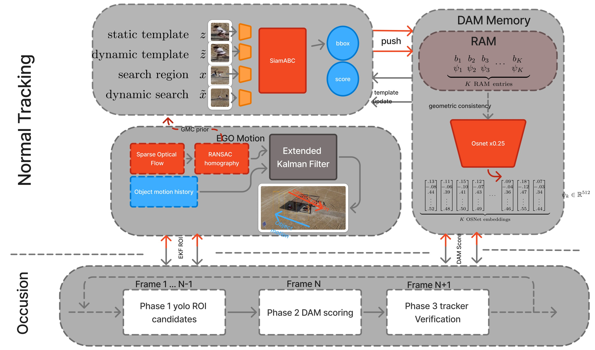

# SiamRAM

Confidence-gated Siamese tracking with distractor-aware memory and multi-phase
reacquisition. This branch is our **MTC-AIC4 Phase 2** submission.


## Contents

- [Overview](#overview)
- [Repository structure](#repository-structure)
- [Installation](#installation)
- [Checkpoints (download links)](#checkpoints-download-links)
- [Usage](#usage)
- [Training](#training)
- [Configuration](#configuration)
- [Profiler](#profiler)
- [Authors](#authors)
- [Citation](#citation)

## Overview

SiamRAM tracks a single object through a video given only its box in the first
frame. A fast Siamese core (SiamABC) runs every frame and emits a box plus a
confidence score; that score is recalibrated so a single threshold reliably says
"target present / target absent." Three robustness modules stay idle until the
score reports trouble, so compute follows difficulty:

- **Camera-aware EKF** — estimates camera motion (Lucas–Kanade flow + RANSAC
  homography) and folds it into the Kalman predict step, so the velocity
  estimate stays object-only. Warps the previous box forward and drives the
  search region during loss.
- **Two-tier appearance memory (RAM → DRM)** — OSNet embeddings of recent
  confident views (RAM) are promoted to a long-term recovery bank (DRM) only
  after they prove temporally stable. This is the primary distractor defence.
- **Multi-phase reacquisition** — when confidence drops below the loss gate, the
  tracker rebuilds its motion estimate and finds the target again: SiamABC alone
  if YOLO can't see it, otherwise YOLO candidates ranked by appearance memory and
  confirmed by SiamABC before tracking resumes.

Full design details are in the [System Description](docs/system_description.pdf).



## Repository structure

`predictor.py` is the only file we wrote against the competition framework — it
implements the `load_model` and `run_tracker` functions the grader's `inference.py`
calls. Everything it relies on lives under `src/`, and every setting comes from
`src/config/inference_config.yaml`.

```text
.
├── predictor.py            # The file we wrote: load_model + run_tracker
├── inference.py            # Grader's runner (provided): manifest → CSV
├── check_submission.py     # Grader's CSV validator (provided)
├── download.py             # Fetches the three inference checkpoints from Google Drive
├── requirements.txt        # x86_64 + CUDA 12.8 dependencies (pinned)
├── Dockerfile.gpu          # Docker (GPU) image
├── docker-compose.yml      # Docker (GPU) build + run
├── test.json               # Example manifest (public_lb split)
└── src/
    ├── config/inference_config.yaml   # Inference settings
    ├── config/training_config.yaml    # Training settings
    ├── models/siamram/     # Tracker, recovery, memory, motion, GMC
    ├── models/SiamABC/     # Siamese base tracker
    ├── data_prep/          # build_dataset_index.py — frame index builder
    ├── training/           # train_head.py — SiamABC head fine-tuning
    └── utils/              # Shared helpers (dataset, losses, training loop)
```

## Installation

Pick **one** of the two paths below.

### Option A — Docker (GPU, recommended)

The container ships the exact Python 3.10 + CUDA 12.8 environment, so nothing to
match on the host. Needs Docker with the NVIDIA Container Toolkit. From the repo
root:

```bash
docker compose up -d --build   # build once
docker compose exec gpu bash    # shell into it
```

The repo is mounted at `/app`, so edits on the host show up inside the container.
Run every command below from that shell. Stop it with `docker compose down`.

### Option B — pip

Use a **Python 3.10** environment — the pinned wheels are built for it:

```bash
python3.10 -m venv .venv
source .venv/bin/activate        # Windows: .venv\Scripts\activate
pip install -r requirements.txt
```

The torch / torchvision / torch-tensorrt wheels are pinned to `+cu128` builds and
pulled from the PyTorch CUDA 12.8 index (declared inside `requirements.txt`).

## Checkpoints (download links)

All weights are hosted on Google Drive. `python download.py` fetches the three
inference checkpoints automatically, but here are the **direct download links**
so they can be grabbed manually and dropped into `checkpoints/`:

| File | Used for | Direct download |
|------|----------|-----------------|
| `model.pth` (SiamABC backbone) | Inference + training init | [download](https://drive.google.com/uc?export=download&id=1VQdAZj0Mpf_ZMxvoZOaCRp3uo6wOPuDC) · [view](https://drive.google.com/file/d/1VQdAZj0Mpf_ZMxvoZOaCRp3uo6wOPuDC/view) |
| `yolo11n.pt` (YOLO re-detector) | Inference | [download](https://drive.google.com/uc?export=download&id=1WUAArjVjMwrluMWBBlTqGO7NBkDy_CMv) · [view](https://drive.google.com/file/d/1WUAArjVjMwrluMWBBlTqGO7NBkDy_CMv/view) |
| `osnet_x0_25_imagenet.pth` (OSNet descriptor) | Inference | [download](https://drive.google.com/uc?export=download&id=1rb8UN5ZzPKRc_xvtHlyDh-cSz88YX9hs) · [view](https://drive.google.com/file/d/1rb8UN5ZzPKRc_xvtHlyDh-cSz88YX9hs/view) |
| `SiamABC_init_checkpoint.pth` (raw SiamABC, broken head) | Optional training-from-scratch init | [download](https://drive.google.com/uc?export=download&id=1sM88OYPNgu1-iLgcjn4OBt9rdXLEE9AW) · [view](https://drive.google.com/file/d/1sM88OYPNgu1-iLgcjn4OBt9rdXLEE9AW/view) |

All four files also live in one [Google Drive folder](https://drive.google.com/drive/folders/1BRPhnBnU9CDLU5qQPv-zQeKtqv1HMsl4?usp=drive_link).

## Usage

### 1 — Download checkpoints

The tracker needs three weight files in `checkpoints/`:

- `model.pth` — SiamABC backbone
- `yolo11n.pt` — YOLO re-detector
- `osnet_x0_25_imagenet.pth` — OSNet appearance descriptor

```bash
python download.py
```

> The checkpoints are also fetched automatically on the first `inference.py` run,
> so the machine needs network access once.

### 2 — Run inference

`inference.py` takes the manifest, the split name inside it, and the output CSV:

```bash
python inference.py test.json public_lb submission.csv
```

The manifest lists each sequence's `video_path` and `annotation_path` (the
first-frame box). Those paths are read relative to the directory you launch from,
so run the command from the folder that holds the dataset:

```text
.
├── test.json
└── dataset1/
    └── basketball_4/
        ├── basketball_4.mp4
        └── annotation_first_box.txt   # one line: x,y,w,h
```

### 3 — Validate the submission

Confirm a predictions CSV has the right columns and the same frame IDs as a
reference CSV before submitting:

```bash
python check_submission.py reference.csv submission.csv
```
    
## Training

The training entry point is `src/training/train_head.py`. It fine-tunes the
SiamABC classification + bbox head (backbone frozen) so the confidence score
becomes discriminative. It is a **two-step** process: build a frame-level index
from the raw videos, then fine-tune against it. All hyperparameters live in
`src/config/training_config.yaml`. Run every command from the repo root.

### Step 0 — Checkpoint the trainer starts from

The training config (`model.weights_path`) starts from
`checkpoints/inference_checkpoint.pth`, which is the same file as `model.pth`.
After `python download.py`, make that name available:

```bash
cp checkpoints/model.pth checkpoints/inference_checkpoint.pth
```

> To instead fine-tune the raw (pre-fix) head, download
> `SiamABC_init_checkpoint.pth` from the links above into `checkpoints/` and set
> `model.weights_path` to it in `src/config/training_config.yaml`.

### Step 1 — Build the dataset index

This decodes the videos under `data/` into frames at `data/<dataset>/<seq>/img/`
and writes the CSV index the training loader expects
(`data/train_dataframe.csv`). Run it once per dataset:

```bash
python src/data_prep/build_dataset_index.py --data data
```

If the frames are already extracted, add `--skip-extraction` to only (re)build
the CSV.

### Step 2 — Fine-tune the head

```bash
python src/training/train_head.py --config src/config/training_config.yaml
```

Override the dataset CSV without editing the config with `--csv_path`:

```bash
python src/training/train_head.py --config src/config/training_config.yaml --csv_path data/train_dataframe.csv
```

Checkpoints are written to the `output.checkpoint_dir` set in the config
(`training/checkpoints/training_run1/` by default) as `head_epoch_<NNN>.pth`. To
run inference with a freshly trained checkpoint, point `model.pth` (or the
SiamABC `weights_path` in `src/config/inference_config.yaml`) at it.

## Configuration

Every setting lives in `src/config/inference_config.yaml` — model and tracker
hyperparameters, the SiamABC/YOLO/OSNet checkpoint paths, and runtime switches.
`predictor.py` reads from it and never overrides it, so the config is the single
place to change behaviour.

## Profiler

`src/profiler.py` measures where SiamRAM spends its compute. It profiles each
neural component, runs a real video to count how often each one fires, and
prints two tables: a **GFLOPs breakdown** (weighted GFLOPs/frame, split into
normal tracking vs occlusion-mode YOLO) and a **latency breakdown** (per-component
ms/fps on the deployed backend, with an end-to-end estimate).

Run it from the repo root — it defaults to the `RcCar4` sequence:

```bash
python src/profiler.py
python src/profiler.py --video VIDEO.mp4 --annot ANNOT.txt  # different sequence
python src/profiler.py --frames 200                         # 0 = full video
python src/profiler.py --warmup 10 --reps 50                # faster, less precise
```

## Authors

- Mohammed Metwally — [@MohammedAhmed124](https://github.com/MohammedAhmed124)
- Yousif Abdulhafiz — [@ysif9](https://github.com/ysif9)
- Ahmed Lotfy — [@alofty25](https://github.com/alofty25)
- Philopater Guirgis — [@Philodoescode](https://github.com/Philodoescode)
- Soliman Elhassanein — [@SolimanElhassanein](https://github.com/Soliman-Elhassanein)

## Citation

```bibtex
@misc{siamram2026,
  author       = {Metwally, Mohammed and Abdulhafiz, Yousif and Lotfy, Ahmed and Guirgis, Philopater and Elhassanein, Soliman},
  title        = {{SiamRAM}: Robust Long-Term Visual Tracking with Distractor-Aware Reacquisition Memory},
  year         = {2026},
  howpublished = {\url{https://github.com/MohammedAhmed124/SiamRAM}},
}
```
