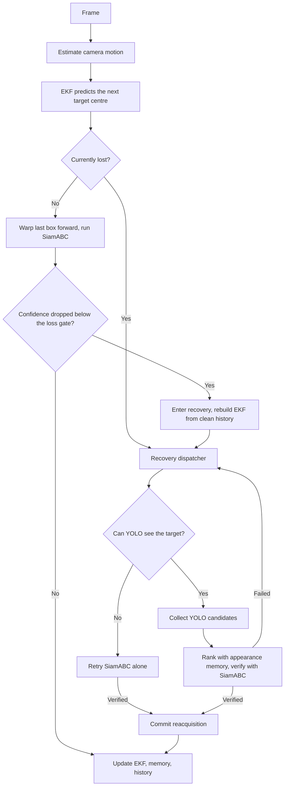

# SiamRAM

Robust long-term visual object tracking with occlusion recovery and
appearance-aware reacquisition. This branch is our MTC-AIC4 Phase 2 submission.


## What this is

SiamRAM tracks a single object through a video given only its box in the first
frame. It pairs a fast Siamese tracker (SiamABC) with a recovery system that
takes over when the target is lost, so camera shake, brief occlusion, and
look-alike distractors are handled differently instead of all breaking tracking
the same way.

The submission follows the Phase 2 layout. The grader's runner, `inference.py`,
imports two functions from `predictor.py`:

- `load_model(device)` builds the tracker once.
- `run_tracker(model, video_path, init_box_path)` tracks one video and returns
  its box on every frame.

`predictor.py` is the only file we wrote against the framework. Everything it
relies on lives under `src/`, and every setting comes from one config file
(`src/config/inference_config.yaml`).

## How it works



The pieces, in order of how a frame flows through them:

- **Camera motion (GMC).** Background motion between frames is estimated with
  grid optical flow plus affine RANSAC. When the estimate is reliable it warps
  the previous box forward to give SiamABC a better starting point, and it feeds
  the motion model and the recovery logic.
- **Motion model (EKF).** A Kalman filter on the target centre predicts where to
  look next. While the target is lost it drives the expanding search region, and
  it pins the search to the frame edge when the target left the view.
- **SiamABC.** The per-frame local tracker. It produces a box and a confidence
  score every frame.
- **Appearance memory (RAM/DRM).** Recent confident appearances (RAM) and
  longer-term confirmed ones (DRM) describe what the target looks like, plus a
  distractor bank of known look-alikes to reject. OSNet is the default
  descriptor backend.
- **Occlusion recovery.** When confidence stays low past the loss gate, the
  tracker rebuilds its motion estimate from clean history and tries to find the
  target again: SiamABC alone if YOLO can't see it, otherwise YOLO candidates
  ranked by appearance memory and confirmed by SiamABC before tracking resumes.

## Setup and running (x86 + CUDA)

Requires Python 3.10 and a CUDA 12.8 GPU.

```bash
pip install -r requirements.txt
```

Then run the grader's entry point. It takes the manifest, the split name inside
it, and the output CSV path:

```bash
python inference.py test.json public_lb submission.csv
```

The checkpoints download automatically on the first run, so the machine needs
network access once. They are saved under `checkpoints/`:

- `model.pth` (SiamABC weights)
- `yolo11n.pt` (YOLO re-detector)
- `osnet_x0_25_imagenet.pth` (OSNet appearance descriptor)

The manifest lists each sequence's `video_path` and `annotation_path` (the
first-frame box). Those paths are read relative to the directory you launch
from, so run the command from the folder that holds the dataset, for example:

```
.
├── test.json
└── dataset1/
    └── basketball_4/
        ├── basketball_4.mp4
        └── annotation_first_box.txt   # one line: x,y,w,h
```

## Running on a Jetson Orin Nano

A Jetson is a different platform from an x86 GPU box (it has its own CUDA,
PyTorch, and OpenCV from JetPack), so it gets its own Docker image instead of
this `requirements.txt`. See **[JETSON.md](JETSON.md)** for the full steps. In
short: pick the base image that matches your JetPack, build `Dockerfile.jetson`,
and set `runtime.use_nvdec: true` in the config to use the hardware decoder.

## Checking a submission CSV

`check_submission.py` confirms a predictions CSV has the right columns and the
same frame IDs as a reference CSV before you submit:

```bash
python check_submission.py reference.csv submission.csv
```

## Configuration

Every setting lives in `src/config/inference_config.yaml` (the hash
marks the commit whose behaviour it reproduces). `predictor.py` reads from it
and does not override it, so the config is the single place to change anything:
model and tracker hyperparameters, the YOLO/OSNet/SiamABC checkpoint paths, and
the runtime switches (`use_nvdec` for hardware decoding, `cudnn_benchmark`).

## Project structure

```
.
├── predictor.py               # The file we wrote: load_model + run_tracker
├── inference.py               # Grader's runner (provided): manifest -> CSV
├── check_submission.py        # Grader's CSV validator (provided)
├── download.py                # Fetches the three checkpoints from Google Drive
├── requirements.txt           # x86 + CUDA 12.8 dependencies (pinned)
├── requirements.jetson.txt    # Extra deps for the Jetson image
├── Dockerfile.jetson          # Jetson Orin Nano image
├── docker-compose.jetson.yml  # Convenience wrapper for the Jetson image
├── JETSON.md                  # Jetson build/run guide
├── test.json                  # Example manifest (public_lb split)
└── src/
    ├── config/
    │   └── inference_config.yaml   # All settings
    ├── models/
    │   ├── siamram/            # SiamRAM tracker, recovery, memory, motion, GMC
    │   └── SiamABC/            # Siamese base tracker (+ TensorRT engine)
    └── utils/                  # Shared helpers (IoU, descriptors, logging, etc.)
```

## Authors

- Mohammed Metwally — [@MohammedAhmed124](https://github.com/MohammedAhmed124)
- Yousif Abdulhafiz — [@ysif9](https://github.com/ysif9)
- Ahmed Lotfy — [@alofty25](https://github.com/alofty25)
- Philopater Guirgis — [@Philodoescode](https://github.com/Philodoescode)
- Soliman Elhassanein — [@SolimanElhassanein](https://github.com/Soliman-Elhassanein)

## Citation

```bibtex
@misc{siamram2026,
  author       = {Metwally, Mohammed and Abdulhafiz, Yousif and Lotfy, Ahmed and Guirgis, Philopater and Elhassanein, Soliman},
  title        = {{SiamRAM}: Robust Long-Term Visual Tracking with Distractor-Aware Reacquisition Memory},
  year         = {2026},
  howpublished = {\url{https://github.com/MohammedAhmed124/SiamRAM}},
}
```
