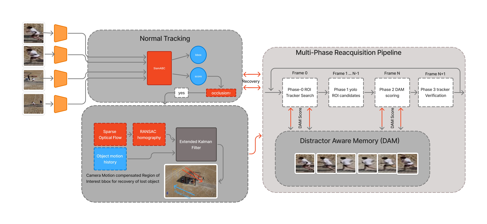

# SiamRAM

<div align="center">

**Robust long-term visual object tracking with occlusion recovery and distractor-aware reacquisition**

[](https://www.python.org/)
[](https://pytorch.org/)
[](https://developer.nvidia.com/cuda-toolkit)
[](LICENSE)

</div>

## Abstract

SiamRAM is a hybrid visual object tracker designed for robust long-term tracking under occlusion. It combines a Siamese
network base tracker (SiamABC) with YOLO-based re-detection, an Extended Kalman Filter (EKF) for motion-compensated
region-of-interest prediction, and a Distractor-Aware Memory (DAM/DRM) bank for candidate verification during
reacquisition. When the primary tracker loses confidence, SiamRAM enters a structured multi-phase recovery pipeline that
expands the search region, filters YOLO detections against the appearance memory, and re-initialises the tracker only on
high-confidence matches — substantially reducing false reacquisitions caused by distractors.

## Table of Contents

- [System Architecture](#system-architecture)
- [Installation](#installation)
- [Checkpoints](#checkpoints)
- [Quick Start](#quick-start)
- [Project Structure](#project-structure)
- [Authors](#authors)
- [Citation](#citation)

## System Architecture



SiamRAM is organised around three cooperating subsystems.

### 1. Normal Tracking

SiamABC runs every frame, producing a bounding-box prediction and confidence score. High-confidence frames are admitted
into a short-term appearance buffer (`AppearanceMemory`) and used to update the EKF.

### 2. EKF and Camera-Motion Compensation

`BBoxEKF` tracks the target centre with a constant-velocity model, optionally compensating for camera motion via a
homography matrix. Its prediction defines the search ROI when tracking fails.

### 3. Multi-Phase Reacquisition Pipeline (DAM/DRM)

When confidence drops below `conf_threshold`, SiamRAM enters occlusion mode:

1. **ROI search** — a growing window centred on the EKF prediction is searched.
2. **YOLO candidates** — detections inside the ROI are scored against the appearance memory (cosine similarity, IoU,
   motion, temporal decay).
3. **DRM verification** — the top candidate re-initialises SiamABC; tracking resumes only if the resulting score exceeds
   `reacq_threshold`.

For full design details see the [System Description](docs/system_description.pdf).

## Installation

For Docker, VSCode Devcontainer, and local `uv` options see the dedicated guides:

- [CUDA / GPU Installation Guide](docs/install-CUDA.md) — covers Native Docker, VSCode Devcontainer, and local `uv` with
  CUDA
- [CPU-only Installation Guide](docs/install-CPU.md) — covers Native Docker, VSCode Devcontainer, and local `uv` without
  GPU

## Checkpoints

SiamRAM uses two weight files in `checkpoints/`:

- `head_epoch_000.pth`
- `yolo11n.pt`

Download them manually with the provided scripts:

- Linux/macOS:

```bash
./checkpoints/download-checkpoints.sh
```

- Windows:

```bat
checkpoints\download-checkpoints.bat
```

- Direct Python (all platforms):

```bash
python checkpoints/download_checkpoints.py
```

`run_inference.py` now auto-downloads these checkpoints if they are missing.

## Quick Start

The script assumes the AIC-4 competition data layout:

```
data/
├── metadata/
│   └── contestant_manifest.json
└── <dataset_name>/
    ├── <video_id>/
    │   └── video.mp4
    └── annotations/
        └── <video_id>.txt     # single line: x,y,w,h
```

All default paths are resolved relative to the repository root, so the script works correctly regardless of which
directory you invoke it from.

Place your data under `data/`, then run with defaults:

```bash
python run_inference.py
```

Override any path or setting via flags:

```bash
python run_inference.py \
    --data_dir data/ \
    --manifest_path data/metadata/contestant_manifest.json \
    --weights_path checkpoints/inference_checkpoint.pth \
    --outputs_dir outputs/SiamRAM \
    --submission_csv submission.csv
```

### CLI arguments

| Argument             | Default                                  | Description                                                                               |
|----------------------|------------------------------------------|-------------------------------------------------------------------------------------------|
| `--data_dir`         | `data`                                   | Root directory containing video files and annotation sub-folders                          |
| `--manifest_path`    | `data/metadata/contestant_manifest.json` | Path to the competition manifest JSON file                                                |
| `--weights_path`     | `checkpoints/head_epoch_000.pth`         | Path to the SiamABC checkpoint (`.pth` file)                                              |
| `--yaml_config_path` | `config/inference_config.yaml`           | Path to the inference config YAML file                                                    |
| `--outputs_dir`      | `outputs/SiamRAM`                        | Directory where per-video bounding-box predictions are written                            |
| `--model_size`       | `M`                                      | SiamABC model size (`S`, `M`, or `L`)                                                     |
| `--lambda_tta`       | `0.1`                                    | TTA lambda for the base tracker                                                           |
| `--datasets`         | all sub-dirs in `--data_dir`             | Dataset names to include; defaults to every folder inside `data/` (excluding `metadata/`) |
| `--submission_csv`   | `submission.csv`                         | Output path for the submission CSV file                                                   |

## Project Structure

```
SiamRAM/
├── models/                  # Tracker implementations
│   ├── SiamRAM.py           # Main SiamRAMTracker class
│   ├── ram_memory.py        # AppearanceMemory and DRM bank
│   ├── motion_model.py      # BBoxEKF (Extended Kalman Filter)
│   └── SiamABC/             # Siamese base tracker
├── utils/                   # Shared utilities (IoU, descriptors, cosine sim)
├── config/                  # YAML configuration files
│   └── inference_config.yaml
├── vis/                     # Visualisation and inference runner
├── training/                # Training scripts and data loaders
├── containers/              # Docker Compose files and verification script
│   ├── docker-compose.gpu.yml
│   ├── docker-compose.cpu.yml
│   └── test.py
├── notebooks/               # Jupyter notebooks
│   └── SiamRAM.ipynb
├── docs/                    # Installation guides and assets
│   ├── install-CUDA.md
│   ├── install-CPU.md
│   ├── system_description.pdf
│   └── system_diagram.png
├── data/                    # Put your data here (videos, annotations, manifest)
├── checkpoints/             # Model weight files (not tracked)
├── requirements.txt         # Pip dependencies (device-agnostic)
├── pyproject.toml           # uv dependencies and poe task definitions
└── run_inference.py         # Entry-point inference script
```

## Authors

- Mohammed Metwally — [@MohammedAhmed124](https://github.com/MohammedAhmed124)
- Yousif Abdulhafiz — [@ysif9](https://github.com/ysif9)
- Ahmed Lotfy — [@alofty25](https://github.com/alofty25)
- Philopater Guirgis — [@Philodoescode](https://github.com/Philodoescode)
- Soliman Elhassanein - [@SolimanElhassanein](https://github.com/Soliman-Elhassanein)

## Citation

If you find SiamRAM useful in your research, please cite:

```bibtex
@misc{siamram2026,
  author       = {Metwally, Mohammed and Abdulhafiz, Yousif and Lotfy, Ahmed and Guirgis, Philopater and Elhassanein, Soliman},
  title        = {{SiamRAM}: Robust Long-Term Visual Tracking with Distractor-Aware Reacquisition Memory},
  year         = {2026},
  howpublished = {\url{https://github.com/MohammedAhmed124/SiamRAM}},
}
```
