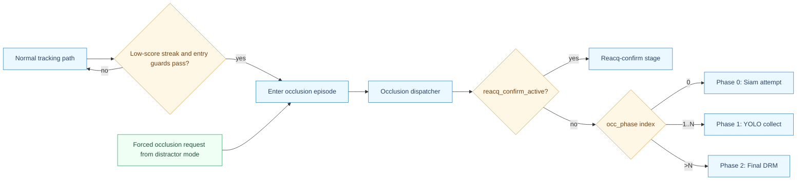
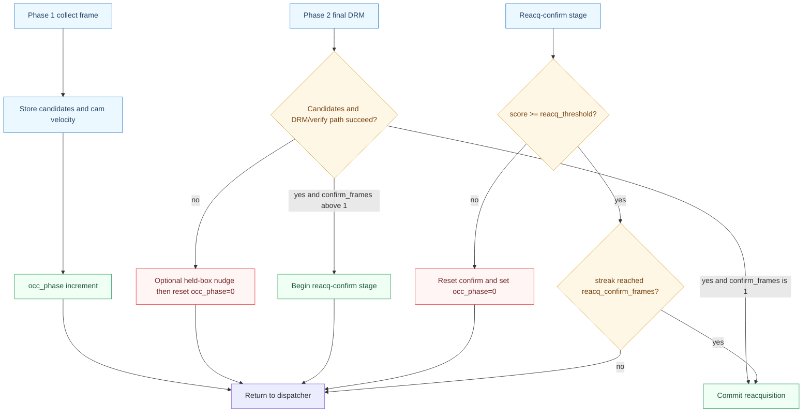
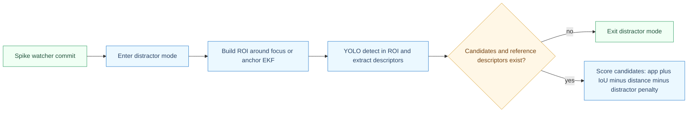
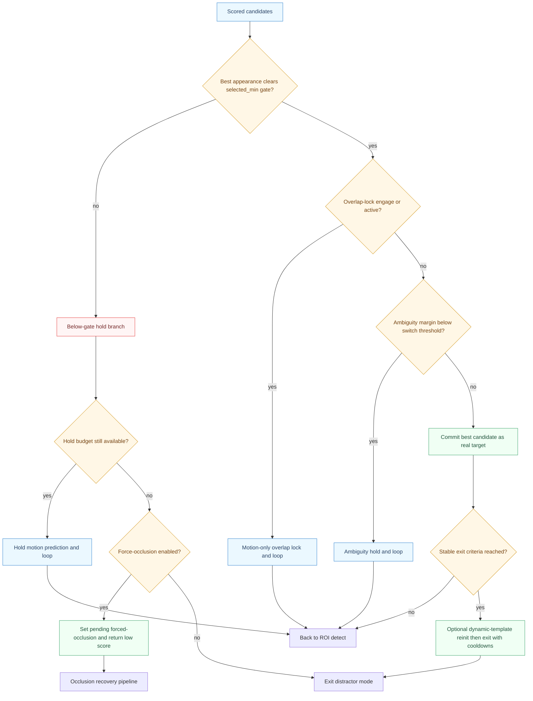

# SiamRAM Full Repository Audit and Theory Report

Generated: 2026-05-29
Repository: `/home/moha/SiamRAM`

## 1) Scope and Confidence

This report is a code-driven audit of SiamRAM focusing on:
- architecture and control flow,
- tracking theory and algorithmic rationale,
- exact occlusion and distractor-mode behavior,
- config-to-runtime mapping,
- validation status, risks, and recommendations.

Confidence level:
- High for static architecture/theory mapping (directly traced from implementation).
- Medium for runtime correctness because automated tests could not be executed in this environment (`pytest` not installed).

## 2) Repository Topology

Main components:
- `run_inference.py`: end-to-end dataset/manifest inference orchestrator.
- `vis/test_model.py`: frame loop, overlays, and timing instrumentation.
- `models/SiamABC/*`: base Siamese tracker network and tracking logic.
- `models/siamram/*`: SiamRAM orchestration layers (occlusion, distractor mode, memory, motion).
- `config/inference_config_experimental.yaml`: primary grouped inference config.
- `tests/*`: config flattening tests, checkpoint download tests, regression harness, siamese-backend smoke test.

SiamRAM core modules:
- `models/siamram/tracker.py`: top-level state machine and integration hub.
- `models/siamram/occlusion_recovery.py`: occlusion phases and reacquisition commit/reset.
- `models/siamram/distractor_mode.py`: distractor suppression and ROI candidate arbitration.
- `models/siamram/spike_watcher.py`: jump/spike detection and switch-to-distractor logic.
- `models/siamram/memory.py`: RAM + DRM appearance memory and scoring.
- `models/siamram/motion.py`: `BBoxEKF` state estimator.
- `models/siamram/camera_motion.py`: homography/GMC estimation and heavy-motion gating.
- `models/siamram/tracker_state.py`: typed state records and lockstep history commits.

## 3) System Theory

### 3.1 Base Tracker (SiamABC)

SiamABC is the short-term tracking engine:
- Static template features from frame 0.
- Dynamic template/search features refreshed from high-confidence memory frames.
- Per-frame prediction from Siamese feature matching + box decoding.
- Optional IoU-head-informed confidence gating.

Core runtime path:
1. `SiamABCTracker.initialize(...)` seeds static and dynamic features.
2. `SiamABCTracker.update(...)` runs `run_track(...)` each frame.
3. Dynamic memory admission requires score/IoU continuity gates.
4. Every `N` frames, dynamic template is refreshed from best recent frame.

Theory: this is a "track-by-similarity" local optimizer that is fast and precise when target identity is stable, but vulnerable when confidence degrades under heavy occlusion or distractor swaps.

### 3.2 Motion Model (EKF + Camera Motion)

`BBoxEKF` tracks center-state:
- state `x = [cx, cy, vx, vy]`,
- measurement `z = [cx, cy]` from tracker box centers.

Prediction:
- with reliable homography `H`, center is warped by camera motion before velocity integration,
- otherwise constant-velocity center prediction.

Update:
- measured center updates state via Kalman gain,
- width/height are smoothed separately as latent box size state.

Camera-motion subsystem:
- modes: `classic`, `accurate`, `botsort`,
- reliability gates for translation/scale/rotation/corner warp,
- heavy-motion detector can block false occlusion/distractor transitions,
- optional GMC search prior warps prior bbox into next-frame camera frame.

Theory: separates target egomotion from camera motion so loss detection and reacquisition search stay physically plausible.

### 3.3 Appearance Memory (RAM + DRM)

RAM admission (`try_admit`):
- IoU continuity gate: `IoU(b_t, b_{t-1}) >= tau_iou`
- area consistency gate: relative area deviation <= `tau_area`

DRM promotion:
- in recent window `W`, if agreements with new descriptor satisfy
  `count(cos(desc_new, desc_i) >= tau_sim) >= mmin`,
  promote to long-term DRM bank.

DRM candidate score (`drm_match` conceptually):
- per anchor `k`:
  - IoU term,
  - appearance cosine term,
  - motion-direction consistency term,
  - temporal recency decay,
  - optional distractor-bank penalty,
- candidate uses max over anchors,
- plus spatial distance penalty from predicted search center,
- plus optional candidate-direction bonus.

Theory: RAM is conservative short-term identity memory; DRM is resilient long-term identity + motion prior for reacquisition under uncertainty.

## 4) End-to-End Runtime Pipeline

### 4.1 Inference Orchestration

`run_inference.py`:
- parses dataset/manifest/weights/config,
- flattens grouped SiamRAM config via `flatten_ram_tracker_config(...)`,
- builds base tracker (`get_tracker` or TRT path),
- wraps with `SiamRAMExperimentTracker`,
- runs sequence loop through `vis/test_model.run_inference(...)`,
- aggregates output predictions into submission format.

### 4.2 SiamRAM Frame Update

`SiamRAMExperimentTracker.update(frame)`:
1. Prescale full frame to processing resolution cap.
2. Estimate homography / camera motion reliability.
3. EKF predict.
4. If `in_occlusion`: execute occlusion phase state machine.
5. Else: execute normal tracking path.
6. Sync visual state and scale outputs back to full-resolution coordinates.

## 5) Occlusion Mode: Exact Logic

Occlusion entry is triggered in normal mode when:
- score < effective threshold for `entry_patience` streak,
- optional camera-motion guard does not block,
- then tracker classifies loss cause and rebuilds EKF from clean history.

Key entry-time refinements:
- shrinkage and center-drift skip depth estimation,
- out-of-frame edge direction detection,
- robust velocity reseed from history,
- disable template updates and handoff to occlusion phases.

### 5.1 Occlusion Graphs (Human-Readable)

Reading order:
1. Entry + dispatcher (what runs each occlusion frame).
2. Phase 0 policy and failed-phase routing.
3. Collection/final/confirm sub-loop and commit.

#### 5.1.A Entry and Dispatcher



#### 5.1.B Phase 0 (Siam Attempt + Detectability Policy)

```mermaid
flowchart TD
    classDef decision fill:#fff7e6,stroke:#d69e2e,color:#744210,stroke-width:1px;
    classDef phase fill:#ebf8ff,stroke:#3182ce,color:#2a4365,stroke-width:1px;
    classDef action fill:#f0fff4,stroke:#38a169,color:#22543d,stroke-width:1px;
    classDef fail fill:#fff5f5,stroke:#e53e3e,color:#742a2a,stroke-width:1px;

    S[Phase 0 start]:::phase --> P{Detectability policy active and target YOLO-detectable?}:::decision
    P -- yes --> S1[Set occ_phase=1 and return held_box]:::action
    S1 --> R[Return to dispatcher]

    P -- no --> T[Seed ROI and run Siam update]:::phase
    T --> Q{score >= occ_siam_reacq_threshold?}:::decision
    Q -- no --> F[Failed-phase handler]:::fail
    Q -- yes --> E{Exit-edge gate passes?}:::decision
    E -- no --> F
    E -- yes --> M[Occlusion memory match plus optional direction boost]:::phase
    M --> D{DRM score >= app_match_threshold?}:::decision
    D -- yes --> K[Commit reacquisition]:::action
    D -- no --> F

    F --> Z{phase_after_failed_siam()}:::decision
    Z -- policy active and NOT YOLO-detectable --> Z0[Set occ_phase=0 retry Siam]:::action
    Z -- otherwise --> Z1[Set occ_phase=1 start collection]:::action
    Z0 --> R
    Z1 --> R
```

#### 5.1.C Phase 1, Phase 2, and Reacq-Confirm



### 5.2 Phase Semantics

- Dispatcher pre-step (`occlusion_update`):
  - each occlusion frame refreshes `held_box` from EKF state and increments `occ_frames`,
  - applies out-of-frame edge pinning/unpinning logic before phase dispatch,
  - gives reacq-confirm stage priority over normal phase routing.

- Phase 0 (`occ_phase_siam`):
  - seeds Siam tracker in ROI and runs fast reacq attempt,
  - if detectability policy is active and target is YOLO-detectable, skips Siam commit and sets `occ_phase=1`,
  - if out-of-frame gating is active and a candidate is too far from exit edge, phase 0 rejects and routes to failed-phase handling,
  - if candidate passes Siam threshold and occlusion-memory match (plus optional direction augmentation), commits reacquisition,
  - otherwise falls through `phase_after_failed_siam()`:
    - returns `0` when policy says target is not YOLO-detectable (retry Siam-only),
    - returns `1` otherwise (start YOLO collection).

- Phase 1 (`occ_phase_collect`):
  - run YOLO in adaptive ROI,
  - extract descriptors (optionally capped batch),
  - accumulate candidate frames and camera velocities,
  - increment `occ_phase` every call; dispatcher moves to final phase once `occ_phase > cand_collection_frames`.

- Phase 2 (`occ_phase_final_drm`):
  - find last non-empty collection frame,
  - build candidate velocities by backward frame matching (IoU + appearance),
  - run DRM match with EKF-uncertainty-aware distance sigma,
  - apply candidate-direction consistency,
  - verify top-k with Siam tracker,
  - if verification passes:
    - direct commit when `reacq_confirm_frames <= 1`,
    - otherwise start confirm stage (`reacq_confirm_active=True`),
  - if no candidate path succeeds: reset to phase 0 (with optional held-box nudge toward nearest detection).

- Reacq-confirm stage (`occ_phase_reacq_confirm`):
  - runs while `reacq_confirm_active` is true (dispatcher priority),
  - increments streak on `score >= reacq_threshold`,
  - commits when streak reaches configured `reacq_confirm_frames`,
  - on failure, resets confirm state and restarts occlusion at phase 0.

- Commit (`commit_reacquisition`):
  - EKF update with confirmed box,
  - clear occlusion and distractor episode state,
  - restore tracker update behavior,
  - admit descriptor and append recovery history.

### 5.3 Verification Anchors (Code-Level)

Occlusion routing and phase dispatch were rechecked against:
- `models/siamram/tracker.py`:
  - occlusion entry and immediate handoff: `_normal_update` branch around lines 2314-2416,
  - detectability policy helpers: lines 4267-4289.
- `models/siamram/occlusion_recovery.py`:
  - dispatcher + out-of-frame handling: `occlusion_update` lines 20-107,
  - phase-0 policy/branching: `occ_phase_siam` lines 188-330,
  - phase-1 increment behavior: `occ_phase_collect` lines 333-398,
  - phase-2 reset/verify/confirm transitions: `occ_phase_final_drm` lines 457-677,
  - confirm stage transitions: `occ_phase_reacq_confirm` lines 145-185,
  - final teardown: `commit_reacquisition` lines 680+.

## 6) Distractor Mode: Exact Logic

Distractor mode is a dedicated identity-protection mode after likely target swap.

Entry sources:
- spike/jump watcher commits a distractor-switch event,
- snap back to pre-spike anchor,
- start ROI arbitration around focus/anchor.

Candidate scoring combines:
- target-reference appearance similarity,
- IoU to focus box,
- distance penalty from focus center,
- negative similarity to distractor bank,
- optional Mahalanobis motion gate from anchor EKF.

Stability/hold mechanisms:
- ambiguity hold when top margin is too small,
- below-gate hold when best appearance falls below selected gate,
- overlap motion lock when selected and distractor candidates overlap heavily,
- optional forced handoff to occlusion mode if below-gate hold exhausts.

Exit:
- after stable frames, optionally reinitialize dynamic template only,
- apply reentry cooldown and temporary memory/template freezes to avoid contamination.

### 6.1 Distractor Graphs (Human-Readable)

Reading order:
1. Candidate acquisition and first gating.
2. Arbitration branches (below-gate, overlap-lock, ambiguity-hold, commit, exit).

#### 6.1.A Candidate Acquisition



#### 6.1.B Arbitration and Exit



## 7) Spike/Jitter Rejection Theory

`SpikeWatcher` monitors camera-compensated normalized step size:
- compares current step norm against rolling baseline median,
- requires ratio and absolute gates,
- optional appearance dissimilarity gate,
- can require consecutive confirmations.

When confirmed:
- enters watch/settle phase,
- waits for motion settling or timeout fallback,
- if stable, stores switched descriptor as distractor, snaps to anchor, and enters distractor mode,
- optional score forcing can trigger immediate occlusion transition path.

Theory: this prevents the base tracker from silently locking onto a nearby distractor after a sudden large jump.

## 8) Config System and Behavioral Surface

`config/inference_config_experimental.yaml` groups parameters by subsystem and phase:
- `runtime`, `yolo`, `descriptor`,
- `camera_motion` (`core`, `botsort`, `gating`, `template_adapt`),
- `gmc_prior`,
- `roi_search` (`normal`, `tiny`, `out_of_frame`),
- `memory_history`,
- `occlusion` (`entry`, `detectability_probe`, `phase0_siam`, `phase1_collect`, `phase2_final_drm`, `reacquire_confirm`, `policy`),
- `spike_reject`,
- `distractor_mode` (`entry`, `selection`, `drm`, `focus_distance_penalty`, `motion_gate`, `overlap_lock`, `exit`).

Flattening implementation (`models/siamram/config.py`):
- recursively flattens nested leaves to tracker kwargs,
- detects duplicate leaf keys in `ram_tracker` and raises,
- validates OSNet checkpoint preset choices,
- supports legacy compatibility blocks.

## 9) Validation Performed in This Audit

Executed checks:
- Repository inventory and static code walkthrough of all major modules.
- Python AST parse over tracked `.py` files:
  - Result: `AST OK for 49 python files`.
- Syntax warning scan:
  - `utils/losses.py` has invalid escape sequence warning in docstring text.

Could not run in this environment:
- `python3 -m pytest --version` -> `No module named pytest`
- `.venv/bin/python -m pytest --version` -> `No module named pytest`
- `ruff --version` -> `command not found`
- `python3 -m pip --version` -> `No module named pip`

## 10) Findings and Risks

### Medium
1. README default mismatch for `--weights_path`.
- README says default is `checkpoints/head_epoch_000.pth`.
- CLI actually defaults to `checkpoints/inference_checkpoint.pth`.
- Evidence: `README.md:184`, `run_inference.py:216`.
- Risk: operational confusion and failed runs on fresh setup.

2. README project structure is stale.
- References legacy paths (`models/SiamRAM.py`, `ram_memory.py`, `motion_model.py`) not present in current tree.
- Evidence: `README.md:251-253`.
- Risk: onboarding friction and inaccurate architecture understanding.

### Low
3. Broad exception swallowing in critical runtime branches.
- Example sites in distractor mode and tracker internals use `except Exception` with silent fallback.
- Evidence: `models/siamram/distractor_mode.py:121,444,492`, `models/siamram/tracker.py:1451`.
- Risk: hidden failures degrade behavior without surfacing root cause.

4. Typo-based public config surface (`copile_yolo`).
- Parameter and config key use `copile_yolo` spelling.
- Evidence: `models/siamram/tracker.py:340,447`.
- Risk: discoverability/readability issue; potential mismatch with expected `compile_yolo` naming.

5. SyntaxWarning in loss-doc text.
- Invalid escape sequence warning from math-formatted docstring.
- Evidence: `utils/losses.py` around line 92.
- Risk: future Python strictness may escalate warnings.

### Process risk
6. Test execution gap in current audit environment.
- No `pytest`, no `pip`, no `ruff` available in active runtime.
- Risk: no direct behavioral regression confirmation in this session.

## 11) Recommended Action Plan

Priority 1:
- Fix README defaults and project-structure section to match current code paths.

Priority 2:
- Add explicit logging for currently swallowed exception branches in distractor/occlusion paths.

Priority 3:
- Add targeted unit tests for:
  - occlusion phase transitions,
  - candidate-velocity builder,
  - distractor-mode hold/overlap-lock/force-occlusion branches,
  - spike-watcher commit/timeout paths.

Priority 4:
- Add a compatibility alias for `compile_yolo` while retaining `copile_yolo` for backward config support.

Priority 5:
- Normalize docstring escapes in `utils/losses.py`.

## 12) Key File Reference Index

- `run_inference.py`
- `vis/test_model.py`
- `models/SiamABC/tracker/SiamABC_Tracker.py`
- `models/siamram/tracker.py`
- `models/siamram/occlusion_recovery.py`
- `models/siamram/distractor_mode.py`
- `models/siamram/spike_watcher.py`
- `models/siamram/memory.py`
- `models/siamram/motion.py`
- `models/siamram/camera_motion.py`
- `models/siamram/tracker_state.py`
- `models/siamram/config.py`
- `config/inference_config_experimental.yaml`
- `tests/test_regression.py`
- `tests/smoke_test_siamese_backend.py`
- `tests/test_config_schema.py`
- `tests/test_checkpoint_autodownload.py`
