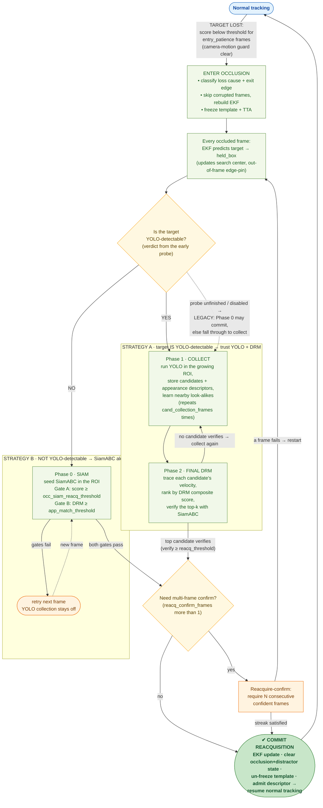
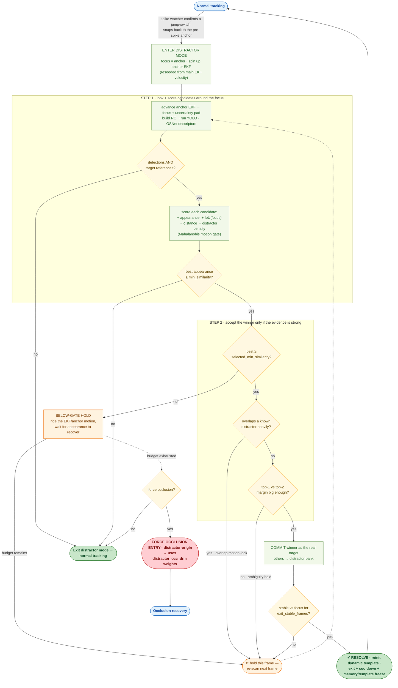
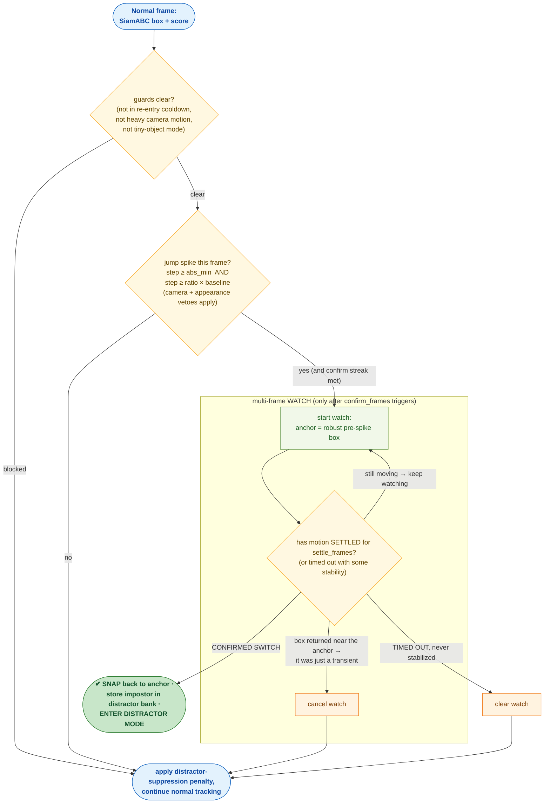

# SiamRAM — Theory, Architecture & Behavior Report

**Author:** Claude (Opus 4.8), code-driven deep read
**Date:** 2026-05-29
**Repository:** `/home/moha/SiamRAM`
**Companion / prior art:** `docs/SIAMRAM_REPOSITORY_AUDIT_REPORT_2026-05-29.md` (Codex). This report is written to be more accurate and more readable; where the two disagree, §13 lists the corrections.

---

## 0. How to read this document

This is meant to be read top-to-bottom like a textbook chapter, *then* used as a reference. The order is deliberate:

1. **The intuition first** (§1) — what problem SiamRAM solves and the one mental model that makes everything else click.
2. **The building blocks** (§2–§5) — the base tracker, the motion model, the camera-motion estimator, and the appearance memory. Each is a self-contained idea.
3. **The conductor** (§6) — the master per-frame state machine that decides which subsystem runs.
4. **The two hard modes** (§7 occlusion, §8 distractor, §9 spike) — with large, accurate diagrams. These are the heart of what the user asked for.
5. **Config, glossary, corrections, validation** (§10–§14).

Every claim is traceable to code; file/line citations look like `tracker.py:2402`. Diagrams are ASCII (they render anywhere — terminal, GitHub, VS Code) and there are Mermaid versions of the two state machines for rich rendering.

A note on honesty: I read the implementation directly. Where the *paper-level* intent and the *actual code* differ, I describe the **code**, because the code is what runs.

---

## 1. The big picture

### 1.1 The problem

Single-object tracking ("here is a box on frame 0, follow this exact object forever") is easy when the target stays visible, sharp, and alone. It gets hard in exactly three ways, and SiamRAM is essentially three answers to those three failures:

| When the target… | …a naive Siamese tracker does this | …and SiamRAM adds |
|---|---|---|
| is briefly hidden / leaves frame | drifts onto background, never recovers | **Occlusion mode** — a structured re-detection pipeline (§7) |
| has a look-alike nearby (another player, another car) | silently snaps to the impostor | **Distractor mode** — identity arbitration (§8) |
| jitters/jumps for one frame (blur, partial occlusion) | locks onto the jump | **Spike rejection** — jump detection that *feeds* distractor mode (§9) |

### 1.2 The one mental model

SiamRAM is a **fast local tracker wrapped in a state machine of safety nets.**

- The **fast local tracker** is **SiamABC** (§2): a Siamese network that, given "where the target was," finds "where it is now" in a small search window. Fast, precise, but myopic — it only looks near the last position and has no notion of identity beyond appearance correlation.
- The **safety nets** are the SiamRAM layer (`models/siamram/`): an Extended Kalman Filter for motion, a camera-motion estimator, an appearance memory (RAM+DRM), and three behavioral modes (normal / distractor / occlusion). They watch the fast tracker and take over when its confidence collapses or its motion looks wrong.

The wrapper class is **`SiamRAMExperimentTracker`** in `models/siamram/tracker.py` (4,409 lines — the integration hub). It owns the base tracker as `self.tracker` and delegates to subsystem objects:

```
SiamRAMExperimentTracker  (models/siamram/tracker.py)
├── self.tracker            → SiamABCTracker          (the fast local engine)         §2
├── self.ekf                → BBoxEKF                  (constant-velocity motion)      §3
├── self.memory             → AppearanceMemory         (RAM short-term + DRM long-term)§5
├── _camera_subsystem       → CameraMotionSubsystem    (homography / GMC prior)        §4
├── _spike_watcher          → SpikeWatcher             (jump detection)                §9
├── _distractor_subsystem   → DistractorModeSubsystem  (identity arbitration)          §8
├── _occlusion_subsystem    → (occlusion_recovery.py)  (re-detection phases)           §7
└── yolo                     → Ultralytics YOLO         (the re-detector used by 7 & 8)
```

### 1.3 Top-level data flow (one frame)

```
                         full-res frame (H×W×3, BGR)
                                   │
                    ┌──────────────▼───────────────┐
                    │ prescale to ≤ max_proc_long_edge (1280)        │  tracker.py:update
                    │ all internal work is in this "proc" resolution │
                    └──────────────┬───────────────┘
                                   │
                    ┌──────────────▼───────────────┐
                    │ estimate camera homography H   │  §4
                    │ EKF.predict(H)  (warp + v·Δt)  │  §3
                    └──────────────┬───────────────┘
                                   │
                        in_occlusion ?  ───── yes ──► OCCLUSION STATE MACHINE  §7
                                   │ no                 (returns held box / zeros)
                                   ▼
                    ┌──────────────────────────────┐
                    │ NORMAL UPDATE                  │  §2 + §6
                    │  SiamABC.update → (bbox,score) │
                    │  detectability probe (early)   │  §7.6
                    │  distractor-active? ─yes─► DISTRACTOR MODE  §8
                    │  else spike/jump rejection     │  §9 (may enter distractor)
                    │  loss streak? ───────────► enter OCCLUSION  §7.1
                    │  else commit frame, EKF.update │
                    └──────────────┬───────────────┘
                                   ▼
                       scale bbox back to full res, emit (bbox, score, in_occlusion, yolo)
```

The single most important structural fact: **per frame, exactly one of `_normal_update` or `_occlusion_update` runs** (`tracker.py:1189`). Occlusion is a separate world with its own internal phase counter; while in it, the public `update()` return is `(zeros, 0.0, in_occlusion=True)` (`tracker.py:1202-1204`) — the *real* internal position is carried in `held_box`, and only the **first frame after reacquisition** emits real coordinates again.

---

## 2. SiamABC — the fast local tracker

Files: `models/SiamABC/model/SiamABC.py` (network), `models/SiamABC/tracker/SiamABC_Tracker.py` (tracking loop), `utils/box_coder.py` (decode).

### 2.1 The network (`SiamABCNet`)

SiamABC is a **dual-template Siamese tracker with polarized self-attention.** "Dual-template" is the key idea and the reason it survives appearance change:

- **Static template** — a crop of the target from frame 0. Never changes. It is the ground-truth identity anchor.
- **Dynamic template** — a crop refreshed during tracking from a recent high-confidence frame. It absorbs gradual change (pose, lighting, scale).

Per frame the network receives four crops — `(static_template, dynamic_template, static_search, dynamic_search)` — and:

1. A **shared backbone** (`Encoder` for size S / `EncoderResNet` for size M) encodes each crop; a `neck` (`AdjustLayer`) projects all to a common channel width (default 256). `SiamABC.py:284`
2. **Template fusion:** static + dynamic template features are concatenated and refined by `FastParallelPolarizedSelfAttention`, then re-projected by `attention_neck`. The same is done for the two search features. `SiamABC.py:374-390`
3. The **BoxTower** (`connect_model`) cross-correlates the attention-refined template against the search features and emits two maps on a 16×16 grid: a **classification map** (is the target here?) and a **regression map** (where exactly?). `SiamABC.py:332`
4. An optional **IoU head** predicts localization quality, used as a confidence gate (§2.3). `SiamABC.py:246`

The `track()` path (`SiamABC.py:417`) is the inference fast-path: template features are computed once and **cached** across frames, so only the search branch runs per frame.

### 2.2 Anchor-free box decoding (FCOS-style)

The regression map is **not** anchors. Each of the 16×16 grid cells predicts four distances — *left, top, right, bottom* — from that cell to the four edges of the box (`utils/box_coder.py:307-312`). A cell is "positive" (inside the target) when all four distances are > 0. Decoding picks the peak of the (penalized) classification map and reads the four edge-distances at that cell to reconstruct `[x,y,w,h]`. This is the FCOS dense-prediction idea adapted to tracking — it gives sub-cell, scale-flexible boxes without anchor tuning.

A **cosine/Hanning window** and an optional **scale/aspect penalty** bias the score map toward the center and toward boxes similar in size to the previous one, which is what keeps a Siamese tracker from teleporting frame-to-frame. These are exposed under `tracker.hanning_window_penalty`: `enabled`, `window_type`, `influence`, `size_penalty_enabled`, `size_penalty_k`, `bbox_size_smoothing_enabled`, and `bbox_size_smoothing_lr`.

### 2.3 The per-frame loop and its two gates (`SiamABCTracker.update`)

`run_track()` produces `(pred_bbox, score)`. Then **dynamic memory admission** is gated twice before a frame is allowed to teach the tracker (`SiamABC_Tracker.py:627-648`):

- **Score gate:** `score > running_confidence` (an EMA of recent scores) **OR** `score ≥ dynamic_update_threshold` (hard floor, 0.80). Stops the tracker from memorizing frames where it's confused.
- **IoU continuity gate:** `IoU(pred, prev) ≥ iou_threshold` (0.6 here). Stops it from memorizing a sudden jump — the classic "I just snapped to a distractor" signature.

Optionally the **IoU head** adds a third gate. Notably, when `use_iou_gate_for_score` is on and the predicted IoU is low, the code applies a **soft 0.25× confidence penalty rather than hard-zeroing the score** (`SiamABC_Tracker.py:888-897`) — a deliberate choice because hard-zeroing caused false occlusion entries on noisy IoU maps.

Every `N` frames (`select_representatives`, `SiamABC_Tracker.py:505`) the **dynamic template is refreshed** from the newest stored frame whose score cleared `dynamic_update_threshold`. The `running_confidence` EMA is updated and clamped at a floor (`running_confidence_floor_value`) so the loss threshold adapts to sequence difficulty without collapsing to zero.

> **Theory takeaway:** SiamABC is a track-by-similarity *local optimizer*. It is fast and precise while identity is stable, and it self-adapts via the dynamic template. Its blind spots — losing the target under occlusion, and silently adopting a look-alike — are exactly the two failure modes the SiamRAM layer exists to catch.

### 2.4 Hypothesis injection (`run_track_for_candidate`)

A crucial primitive used by recovery: given any hypothesized box anywhere in the frame, temporarily set the tracker's state to it, build the search crop around it, run the network, then restore state (`SiamABC_Tracker.py:910`, `:951-975`). This lets occlusion/distractor logic **ask SiamABC "if the target were here, how confident would you be?"** without committing. The returned score is the verification signal for reacquisition.

---

## 3. Motion model — the bounding-box EKF (`motion.py`)

`BBoxEKF` is a **constant-velocity Extended Kalman Filter on the box center.** This is a small module with one very deliberate design decision.

- **State** `x = [cx, cy, vx, vy]` — center position and velocity. **Measurement** `z = [cx, cy]` — the center of the tracker's box.
- **Width/height are NOT in the EKF state.** They are smoothed separately as a slow EMA (`_bw = 0.85·_bw + 0.15·w`, `motion.py:127`).

Why keep size out of the filter? **Immunity to occlusion shrinkage.** When a target is occluded, the tracker's box often collapses to a sliver right before loss. If size fed velocity, that collapse would corrupt the velocity estimate exactly when you most need a clean one to extrapolate where the target went. By tracking only the center, velocity stays physically meaningful through the moment of loss (`motion.py:14-19`).

**Prediction with camera motion** (`predict`, `motion.py:89`): if a reliable homography `H` is available, the center is first **warped by H** (the camera's apparent motion) and *then* advanced by velocity. The Jacobian `F` is computed through the homography so the covariance `P` grows correctly. Without reliable `H`, it's plain constant-velocity. This is what lets the filter say "the target didn't move in the world; the camera panned" instead of inventing target velocity.

Three helper transitions matter for the modes below:
- `update(z)` — standard Kalman correction from a measured center.
- `reseed(bbox, v)` — hard reset of position **and** velocity with inflated covariance (used at occlusion entry from clean history).
- `nudge_position(bbox)` — move the center **without touching velocity** (used to gently steer `held_box` toward a near-miss YOLO detection during failed recovery, §7.5).

`get_uncertainty()` returns √(mean positional variance) — this drives the adaptive search-distance sigma in DRM scoring (§7.4) and the distractor ROI padding (§8).

---

## 4. Camera-motion subsystem (`camera_motion.py`, `botsort.py`)

Everything here serves one purpose: **separate target motion from camera motion** so that loss detection, velocity, and search placement stay physically plausible during pans, shakes, and zooms.

### 4.1 Homography estimation — three modes

`estimate_homography` returns `(H, reliable, gray)` (`camera_motion.py:17`):

- **`classic`** — grid of corners + optical flow + affine RANSAC on a downscaled frame. Fast, default.
- **`accurate`** — feature-based full homography, falling back to classic if it fails.
- **`botsort`** — a BoT-SORT-inspired global motion compensation estimator (`botsort.py`, 580 lines) with strong validity gates (inlier ratio, residual MAD, translation/scale/rotation bounds, spatial coverage cells). Heavier, most robust. A **dynamic exclusion mask** around the target keeps the *target's own* motion out of the *background* motion estimate.

`reliable` is a strict boolean: the fit must pass all validity gates and not be a fallback transform.

### 4.2 GMC search prior (`apply_gmc_search_prior`)

If `H` is reliable and passes plausibility checks (`gmc_motion_is_valid`: bounded translation/scale/rotation/corner-warp, `camera_motion.py:121`), the previous box is **warped forward by `H`** and handed to SiamABC as its search-center prior (`_set_tracker_search_prior`). Effect: when the camera pans hard, SiamABC starts looking where the target *will* be, not where it *was* — preventing the target from sliding out of the search window. It is intentionally skipped in distractor mode (keeps that logic camera-independent).

### 4.3 Heavy-motion gating (`is_heavy_camera_motion`)

Computes both a weighted displacement and an instantaneous displacement, normalized by a reference diagonal, and flags "heavy" when either a pixel gate (`camera_motion_heavy_disp_threshold`, 15 px) or a normalized gate (`camera_motion_heavy_norm_threshold`, 0.2) trips. This single boolean is consumed in three places:

1. **Block occlusion entry** during heavy motion (`block_occlusion_on_camera_motion`) — a transient low score during a pan is usually lag, not loss.
2. **Block distractor-mode entry** during heavy motion (`block_distractor_mode_on_camera_motion`) — apparent jumps during shake are usually ego-motion, not a real switch.
3. **Swap the dynamic-template adaptation params** (`template_adapt`) — under heavy motion the template re-selection cadence/window and admission gates can be temporarily changed so the tracker adapts faster (or steadier) through blur, with a linger period after motion calms.

---

## 5. Appearance memory — RAM + DRM (`memory.py`)

This is the **identity memory** that makes re-detection trustworthy. Two tiers, plus a negative bank.

A **descriptor** is an appearance embedding of a box. The default backend is **OSNet** (a person-re-ID CNN; cosine similarity, `utils/utils.py:221`); an alternative reuses SiamABC's own features compared by 2D cross-correlation. Either way, "are these the same object?" reduces to a similarity score in `[−1, 1]`.

### 5.1 RAM — short-term buffer (`try_admit`)

A rolling deque of `(bbox, descriptor)` for recent confident frames. Admission requires two gates (`memory.py:155-166`):
- **IoU continuity:** `IoU(bbox, prev_bbox) ≥ tau_iou`.
- **Area consistency:** the new box area must be within `tau_area` of the buffer's median area.

So RAM only remembers frames where the target moved smoothly and kept a sensible size — a clean, conservative identity record.

### 5.2 DRM — long-term reacquisition bank (`_try_promote_to_drm`)

The Dynamic Reference Memory is the **resilient long-term identity + motion prior** used to recover after loss. A RAM entry is *promoted* to DRM only if, within the recent window `W`, at least `mmin` stored descriptors agree with it (cosine ≥ `tau_sim`) (`memory.py:178-191`). In words: **"I only trust this view into long-term memory if several recent frames independently confirm it's the same object."** This filters out one-off lucky frames.

### 5.3 The DRM composite score (`drm_match`) — the math

This is the function occlusion recovery uses to rank YOLO candidates. For each candidate `c` (with descriptor `d_c`), it scores against every DRM anchor `k` and takes the best:

```
For each DRM anchor k = (box_k, desc_k, age_k):
    s_iou(k)   = λ_iou · IoU(box_k, c)
    s_app(k)   = λ_app · cos(desc_k, d_c)
    s_motion(k)= λ_mot · max(0, cos(velocity, (center_k − center_ref)))   # moving the right way?
    s_time(k)  = λ_time · exp(−α · age_k)                                  # recent anchors weigh more
    s_neg(k)   = γ · max_cos(d_c, distractor_bank)                         # penalize look-alikes
    anchor_score(k) = s_iou + s_app + s_motion + s_time − s_neg

cand_score = max over k of anchor_score(k)                                 # best supporting anchor

# then two spatial/directional adjustments on the candidate itself:
cand_score −= λ_dist · (1 − exp(−½ (d / σ)²))          # d = dist(candidate, search center)
cand_score += λ_cand_dir · cos(velocity, candidate−ref) # bonus for moving toward prediction
```

Candidates above `margin` are kept and sorted; if the best clears `skip_threshold` it's returned alone, else the top-`k` go to verification (`memory.py:241-378`). The `σ` in the distance penalty is **EKF-uncertainty-aware** (§7.4) — the more uncertain the filter, the wider the spatial tolerance.

> **Theory takeaway:** RAM is a strict, conservative *short-term* identity record; DRM is a *long-term* bank that fuses appearance, motion direction, recency, spatial plausibility, and explicit negative evidence against known distractors. The composite is essentially a hand-built scoring function standing in for "is this YOLO box really our target, given everything we know?"

---

## 6. The master per-frame state machine

The three behavioral modes are coordinated by flags on the tracker: `in_occlusion`, `_distractor_mode_active`, and the spike watcher's `_jump_watch_active`. Here is the **authoritative control flow** for one frame, with the exact decision order from `_normal_update` (`tracker.py:2192`) and `update` (`tracker.py:1152`).

```
                              ┌───────────────────────┐
                              │   update(frame)        │
                              │   prescale, est. H,    │
                              │   EKF.predict(H)       │
                              └───────────┬───────────┘
                                          │
                            in_occlusion? ─┴─ yes ─────────────────────────────┐
                                          │ no                                  │
                                          ▼                                     ▼
                          ┌───────────────────────────┐               ╔══════════════════╗
                          │  NORMAL UPDATE             │               ║ OCCLUSION MACHINE ║  §7
                          │  (template/memory freezes  │               ║ (own phase loop)  ║
                          │   tick down; GMC prior;    │               ╚════════┬═════════╝
                          │   camera-motion adapt)     │                        │ commit → in_occlusion=False
                          │                            │◄───────────────────────┘
                          │  pred,score = SiamABC.update│
                          │  class-warmup + detectability probe  (early frames)  §7.6
                          └───────────┬───────────────┘
                                      │
                    _distractor_mode_active ? ──── yes ──► DISTRACTOR MODE UPDATE  §8
                                      │ no                  (returns box/score; may force-enter occlusion)
                                      ▼
                          ┌───────────────────────────┐
                          │  SPIKE / JUMP REJECTION    │  §9
                          │  (may COMMIT → enter        │
                          │   distractor mode this frame)│
                          └───────────┬───────────────┘
                                      │
                          score < effective_threshold for `entry_patience` frames?
                          (and not blocked by heavy camera motion)
                                      │
                          ┌── yes ────┴───────────── no ──┐
                          ▼                               ▼
              ╔══════════════════════╗        ┌───────────────────────────┐
              ║ ENTER OCCLUSION  §7.1 ║        │  HEALTHY FRAME             │
              ║ rebuild EKF, set skip,║        │  EKF.update(pred)          │
              ║ disable template,     ║        │  velocity from history     │
              ║ run first occ frame   ║        │  admit descriptor to RAM   │
              ╚══════════════════════╝        │  commit frame history      │
                                              └───────────────────────────┘
```

Two subtleties worth internalizing:

- **Distractor mode and spike rejection are mutually exclusive arms** of the normal path (`tracker.py:2242` if/else): if you are *already* in distractor mode you run the distractor update; otherwise you run spike rejection (which is what *enters* distractor mode). They never run in the same frame.
- **`effective_threshold` is adaptive** (`_compute_effective_threshold`, `tracker.py:1952`): a far/tiny target (`_is_long_distance`) uses `long_distance_conf_threshold` and a wider search context. So "loss" is judged differently for a 12-px UAV than for a foreground car.

---

## 7. OCCLUSION MODE — exact theory and diagram

**Goal:** the target has been lost (hidden, or left frame). Find it again, confidently, without locking onto a distractor or background — and while it's lost, hold a physically plausible position estimate.

Files: `models/siamram/occlusion_recovery.py` (the phases), `tracker.py` (entry, dispatch wrappers).

### 7.0 Coordinate/output contract

While `in_occlusion`, `update()` returns `(zeros(4), 0.0, True)` to the caller (`tracker.py:1202`). The internally maintained estimate is `held_box`, driven by the EKF every frame. Real coordinates resume the frame after `commit_reacquisition`.

### 7.1 Entry — declaring a loss (in `_normal_update`)

Entry is **hysteretic**, not instantaneous (`tracker.py:2261-2416`):

1. Each frame with `score < effective_threshold` increments `_entry_streak`; a confident frame resets it to 0.
2. A **camera-motion guard** can hold the streak at 0 during heavy pans (unless the target is genuinely exiting the frame).
3. When `_entry_streak ≥ entry_patience` (or `entry_patience_high_motion` under heavy motion), occlusion is entered:
   - Classify **loss cause** (`_classify_loss_cause`) and **exit direction** (`_detect_exit_direction`) → sets `_out_of_frame` / `_exit_edge`.
   - Compute a **skip depth**: `effective_skip = max(shrinkage/drift skip, entry_streak)`. The EKF is **rebuilt from clean history skipping those corrupted last frames** (`_rebuild_ekf_from_clean_history`, `tracker.py:2407`) so the velocity prior reflects healthy motion, not the drift into loss. (For `out_of_frame`/`camera_motion` causes the skip is forced to 0.)
   - **Freeze learning:** `dynamic_update = False`, `disable_tta()` — so the tracker never memorizes the occluder.
   - `_occ_phase = 0`, then `_occlusion_update(frame)` runs immediately — **the entry frame is the first recovery frame.**

### 7.2 Per-frame housekeeping (`occlusion_update`, every occluded frame)

Before any phase logic (`occlusion_recovery.py:46-98`):
- Pull the EKF prediction → update `_search_cx/_cy` and `held_box`; refresh `velocity`; `_occ_frames += 1`.
- **Out-of-frame state machine:** if the target is off-screen, pin the search center to the exit edge; declare it back **in-frame** only when the EKF center is inside *and* velocity points inward. If in-frame, declare **out-of-frame** once the center crosses an edge by more than `0.5·max(median object dim)`.
- Route to a phase by `_occ_phase` (`occlusion_recovery.py:100-107`):

```
reacq-confirm active  → occ_phase_reacq_confirm
_occ_phase == 0       → occ_phase_siam            (Phase 0)
1 .. cand_collect      → occ_phase_collect          (Phase 1)
else                   → occ_phase_final_drm        (Phase 2)
```

### 7.3 Phase 0 — fast SiamABC reacquire (`occ_phase_siam`)

The cheap path: one tracker forward pass, one DRM check. No YOLO yet.

1. Build the **growing search ROI** (`_get_yolo_search_roi`) — a square around the EKF search center that expands geometrically with `_occ_frames` (or an edge-pinned strip when out-of-frame). Plant a seed box at the median object size.
2. Run SiamABC → `score`.
3. **Gate A:** `score ≥ occ_siam_reacq_threshold`.
4. **Exit-edge gate** (early-occlusion mode only): the box must be within 50% of the exit edge.
5. **Gate B (DRM confirmation):** an occlusion-memory match (with `margin = occ_siam_margin` and a single-frame direction bonus) must clear `app_match_threshold`.
6. **Both pass → `commit_reacquisition` (exit).** Either fails → reset the tracker box to `held_box` and advance `_occ_phase = _phase_after_failed_siam()`.

`_phase_after_failed_siam()` is where the **adaptive detectability policy** lives (§7.6): normally it returns 1 (go collect YOLO candidates); in the "not YOLO-detectable" regime it returns 0 (keep retrying SiamABC forever).

### 7.4 Phases 1 & 2 — YOLO collection then DRM verification

**Phase 1 — collect (`occ_phase_collect`), repeated `cand_collection_frames` times:**
- Run YOLO on the growing ROI; extract descriptors for detections (capped by `osnet_max_candidate_batch`); store `(bbox, desc)` into `_cand_frames`; record this frame's camera velocity.
- Any detection heavily overlapping `held_box` (IoU ≥ `tau_occ`) is added to the **distractor bank** (it's near where we lost the target, so it's a prime impostor suspect).
- Gathering across multiple frames is what makes **per-candidate velocity** measurable.

**Phase 2 — final DRM (`occ_phase_final_drm`), the high-quality decision:**
1. Take the last non-empty collection frame's detections as the candidate pool.
2. `_build_candidate_velocities`: trace each candidate backward through earlier collection frames (camera-compensated). Candidates that can't be matched across all prior frames are **dropped** (no reliable velocity). (Single-frame mode skips this.)
3. Drop candidates failing the **50%-of-exit-edge** filter. If none survive → `nudge` `held_box` toward the nearest detection and reset to Phase 0.
4. **DRM composite match** (§5.3) with an **EKF-uncertainty-aware `dist_sigma`** (`_effective_dist_sigma`).
5. **Direction augmentation:** `augmented = drm_score + λ_dir·(2·dir_score − 1)`, where `λ_dir` is **zeroed if out-of-frame** and **halved if tiny/far** (you can't trust direction for a target you can't see / that's a few pixels).
6. Sort; for the **top-k**, motion-compensate by one EKF velocity step and **verify with SiamABC** (`run_track_for_candidate`).
7. First candidate with `verify_score ≥ reacq_threshold`:
   - if `reacq_confirm_frames ≤ 1` → `commit_reacquisition` (exit);
   - else → `begin_reacq_confirmation` (tentative lock).
8. All fail → reset to Phase 0 (loop back to collection).

### 7.5 Reacquire-confirm and commit/exit

**Reacquire-confirm (`occ_phase_reacq_confirm`):** only when `reacq_confirm_frames > 1`. Require N consecutive frames with `score ≥ reacq_threshold`; a single miss restarts at Phase 0. Prevents committing to a one-frame fluke.

**Commit (`commit_reacquisition`, `occlusion_recovery.py:680`)** — the single exit point for every recovery path:
- `EKF.update(bbox)` → smoothed exit box; refresh velocity.
- **Clear all occlusion + distractor episode state** (`in_occlusion=False`, `_out_of_frame`, `_exit_edge`, `_occ_frames`, `_occ_phase`, candidate buffers, all distractor flags, jump-watch).
- **Un-freeze the tracker:** `enable_tta()`, restore `dynamic_update`.
- Admit the reacquired descriptor to memory; sync `current_bbox`/`held_box`/anchors/search center; commit a recovery history entry so the next normal frame starts clean.

**Failure-to-reacquire (any phase):** `held_box` keeps following the EKF (nudged toward the nearest YOLO box when one exists), and the cycle resets to Phase 0. **There is no hard timeout** — occlusion persists until something verifies (a deliberate "never give up the identity" stance).

### 7.6 The adaptive YOLO-detectability policy (a probe that re-shapes Phase 0)

A class-agnostic probe runs **early in normal tracking** (`_maybe_run_detectability_probe`): every `probe_stride` frames, up to `probe_attempts` times, run YOLO on the tracker's search ROI and count a "hit" when any detection overlaps the box by IoU ≥ `iou_thr`. As soon as hits ≥ `min_hits` → **YOLO-detectable = True**; if attempts exhaust without enough hits → **False**.

That single boolean rewrites the occlusion strategy:

```
                   ┌──────────────────────────────────────────────┐
                   │  DETECTABILITY PROBE  (early, normal tracking) │
                   │  YOLO on tracker search ROI, strided           │
                   │  hit = detection IoU ≥ iou_thr on the box      │
                   │  hits ≥ min_hits → DETECTABLE                  │
                   │  attempts exhausted → NOT DETECTABLE           │
                   └───────────────────┬──────────────────────────┘
                                       │ _yolo_detectable ?
                   ┌───────────────────┴────────────────────┐
                 TRUE                                      FALSE
        (YOLO can see this object)              (YOLO never found it)
                   │                                          │
        Occlusion strategy:                       Occlusion strategy:
        rely on YOLO + DRM                        rely on SiamABC alone
                   │                                          │
        Phase 0 (siam): SKIPPED                   Phase 0 (siam): RUN every frame
          → straight to Phase 1                     Gate A: score ≥ occ_siam_reacq_thr
          → Phase 2 DRM verify                      Gate B: DRM ≥ app_match_threshold
                   │                                  pass → COMMIT
        fail → reset, skip again                     fail → stay Phase 0, retry
               (loops collect→DRM)                          (NEVER collect/DRM; loops)
                   │                                          │
                   └──────────────► EXIT occlusion ◄──────────┘
```

Rationale: if YOLO can detect the class, the YOLO+DRM path is strictly stronger, so the cheap SiamABC-alone commit is disabled to avoid premature/false reacquisition. If YOLO *can't* see the object (e.g. an unusual object class), YOLO collection is pointless, so recovery leans entirely on SiamABC's appearance matching. Third path: if occlusion starts **before the probe finishes** (or the feature is off), `_detectability_policy_active()` is False and the **legacy** flow runs (Phase 0 may commit; on failure → collect → DRM).

### 7.7 Occlusion state machine — full diagram (ASCII)

```
        NORMAL TRACKING
              │  score < effective_threshold for entry_patience frames
              │  (not blocked by heavy camera motion)
              ▼
        ┌─────────────────────────────────────────────────────────┐
        │ ENTER OCCLUSION                                            │
        │  classify loss cause + exit edge; skip corrupted frames;   │
        │  rebuild EKF from clean history; freeze template/TTA       │
        └───────────────────────────┬───────────────────────────────┘
                                    │  _occ_phase = 0
        ┌───────────────────────────▼───────────────────────────────┐
        │ every occluded frame: EKF predict → held_box, search center;│
        │ out-of-frame edge-pin state machine                         │
        └───────────────────────────┬───────────────────────────────┘
                                    │ route by _occ_phase
        ┌──────────────┬────────────┴────────────┬───────────────────┐
        ▼              ▼                          ▼                   
  reacq-confirm   PHASE 0  occ_phase_siam    PHASE 1  collect    PHASE 2  final_drm
  active?         ┌──────────────────────┐   ┌──────────────┐    ┌──────────────────────┐
   │              │ detectable? → skip→P1 │   │ YOLO in ROI  │    │ build cand velocities │
   │ run SiamABC; │ else seed SiamABC     │   │ store boxes+ │    │ DRM rank (unc-aware σ)│
   │ need N       │ Gate A: score≥occ_siam│   │ descriptors; │    │ + dir augment         │
   │ consecutive  │ Gate B: DRM≥app_match │   │ feed distractor   │ verify top-k w/ Siam   │
   │ ≥reacq_thr   │                       │   │ bank; repeat │    │ need verify≥reacq_thr  │
   │              └─────┬───────────┬─────┘   │ cand_collect │    └─────┬───────────┬──────┘
   │ pass→COMMIT       pass         fail      └──────┬───────┘     pass  │           │ fail
   │ miss→Phase0     │ COMMIT   _phase_after_        │ _occ_phase++      │           │
   │                 │          failed_siam():       ▼                  │           ▼
   │                 │           detectable→stay/    (advances to    reacq_confirm  reset
   │                 │           else not-det.: 0    Phase 2 when     _frames>1?     →Phase 0
   │                 │           legacy: 1)          counter done)    │
   │                 ▼                                                ▼
   └───────────►  ╔═══════════════════════════════════════════════════════════╗
                  ║ COMMIT REACQUISITION                                         ║
                  ║  EKF.update; clear occ/distractor state; un-freeze template; ║
                  ║  admit descriptor; → resume NORMAL TRACKING next frame       ║
                  ╚═══════════════════════════════════════════════════════════╝
```

### 7.8 Occlusion state machine — Mermaid (for rich rendering)

**How to read all three Mermaid graphs below.** Shapes and colors are consistent:

- 🟦 **Blue stadium** = a *mode boundary* (you enter/leave here: normal tracking, occlusion recovery).
- 🟩 **Green box** = an *action / state* the tracker performs.
- 🟨 **Yellow diamond** = a *decision*.
- 🟧 **Orange box** = a *hold / loop-back* (deliberately waiting, not committing).
- 🟥 **Red box** = a *risky handoff* (forced mode change).
- ✔ **Bold green** = a *successful commit* (the good ending).
- Boxes are grouped into labeled **lanes (subgraphs)** so each phase/stage is visually separate instead of one flat web.

The occlusion graph is centered on the **detectability branch**, because that one boolean picks the entire recovery strategy:



---

## 8. DISTRACTOR MODE — exact theory and diagram

**Goal:** the tracker is at risk of confusing the target with a nearby look-alike. Keep the *right* identity by actively arbitrating between candidates in a focus region, using appearance + motion + explicit negative memory — and refuse to switch unless evidence is strong.

Files: `models/siamram/distractor_mode.py`, scoring helpers in `tracker.py`.

### 8.1 How you get here

Distractor mode is **entered by the spike watcher** (§9) after it confirms a jump-switch and snaps back to a pre-jump anchor (`_enter_distractor_mode`, `distractor_mode.py:88`). Entry seeds a **focus box** (the anchor), captures the tracker's search-crop size, and — if enabled — spins up a **dedicated anchor EKF** reseeded from the main EKF's velocity. From then on, until exit, the per-frame normal path routes to `distractor_mode_update` instead of the spike watcher.

### 8.2 The per-frame arbitration (`distractor_mode_update`)

```
1. Advance the anchor EKF → focus center + uncertainty padding for the ROI.
2. Build ROI around the focus box (target-scale ×2, optionally ≥ tracker crop, + uncertainty pad).
3. YOLO detect inside ROI.
4. Gather target references = recent target descriptor history (or the focus crop).
5. If no detections OR no references → EXIT ("no similar objects in ROI").
6. Score each candidate (top-k by config), then rank by composite score.
```

**Per-candidate composite score** (`_score_distractor_candidates`, `tracker.py:1726`):

```
app_sim   = max cos(cand_desc, ref)   over target references     # is it our target?
iou_focus = IoU(cand, focus_box)                                 # is it where target should be?
maha gate : drop candidate if Mahalanobis²(cand_center; anchor EKF) > threshold  # motion-plausible?
dist_term = 1 − exp(−½ (d_center/σ)²)                            # how far from focus center
neg_sim   = max cos(cand_desc, distractor_bank)                  # does it look like a known impostor?

drm_score = λ_app·app_sim + λ_iou·iou_focus − λ_dist·dist_term − γ·neg_sim
```

The winner is `argmax drm_score`. Everything else in the ROI is, by construction, labeled a **distractor** and its descriptor is added to the negative bank — so the system actively learns what the impostors look like.

An optional **prebank** can also run during normal tracking at `distractor_mode.prebank.stride`: it gathers nearby non-target YOLO detections before a distractor episode starts. In lazy mode it stores crops only and embeds them in one descriptor batch on distractor-mode entry. With `prebank_materialize_immediately` enabled, it runs one batched descriptor extraction on the strided prebank frame and exposes those descriptors through the active distractor bank immediately.

### 8.3 The four ways the winner is *not* immediately accepted

This is the heart of distractor mode — a cascade of **hold/lock guards** that bias hard toward *not* switching identity on weak evidence:

1. **Below-gate hold** (`best_sim < selected_min_similarity`): the top candidate's appearance dipped under the accept gate (blur/pose/partial occlusion). Instead of abandoning the target — which would hand control back to the base tracker (often sitting on the distractor!) and unfreeze memory — **ride the EKF/anchor motion prediction** for up to `below_gate_hold_frames` frames and wait for appearance to recover. The counter resets the instant the winner clears the gate. When `selected_min_similarity` is set to `"auto"`, the gate is learned like `drm_margin: auto`: sample healthy target self-similarity, keep an EMA, subtract `auto_delta`, then clamp to `[auto_min, auto_max]`. If `selected_min_similarity_auto_use_distractor_bank` is enabled and the distractor bank has descriptors, the gate is also kept at least `max_target_vs_distractor_sim + auto_distractor_margin`.
   - **If the hold is exhausted:** exit distractor mode. If `below_gate_force_occlusion` is on, **force an immediate handoff to occlusion recovery** (saturate the entry streak, report sub-threshold score, set `_pending_distractor_occlusion=True`) rather than reverting to a base tracker that may be confidently wrong. That `_pending` flag tags the occlusion episode as **distractor-origin**, which selects the **separate `distractor_occ_drm_*` weight set** in recovery (a recovery biased to avoid re-locking the very distractor we just lost to).

2. **Overlap motion-lock** (`_maybe_engage_overlap_motion_lock`): when the winner heavily overlaps a distractor (IoU ≥ `overlap_iou_enter`), the two are visually fused; rather than flicker between them, engage a **motion-only lock** that holds the EKF-predicted box until the overlap clears for `overlap_clear_frames` (or `overlap_lock_max_frames` elapses).

3. **Ambiguity hold** (`_maybe_apply_ambiguity_hold`): if the top-1 vs top-2 margin is too small (`< switch_margin`), stick with the current pick for up to `ambiguity_hold_frames` rather than switch on a coin-flip.

4. **Stable-exit requirement:** even a clean winner must agree with the focus box (`IoU ≥ exit_same_iou`) for `exit_stable_frames` consecutive frames before the mode is allowed to resolve.

### 8.4 Exit and contamination control

On a confident, stable resolution (`exit_stable_frames` met), the mode optionally **re-initializes the dynamic template only** at the resolved box (`_reinit_dynamic_template_only` — refreshes dynamic features/memory while preserving the frame-0 static template), then exits with `resolved=True`. Resolution arms three contamination guards (`exit_distractor_mode`, `distractor_mode.py:161-170`):
- **Re-entry cooldown** (`reentry_cooldown_frames`): can't re-enter distractor mode immediately.
- **Memory freeze** (`post_exit_memory_freeze_frames`): pause appearance-memory admission.
- **Template freeze** (`post_exit_template_freeze_frames`): pause dynamic-template updates.

These exist because the moment just after a distractor episode is exactly when a wrong descriptor would poison long-term memory.

### 8.5 Suppression even when *not* in distractor mode (`apply_distractor_mode_penalty`)

For `jump_reject_distractor_mode_frames` after a jump, even in normal tracking, the score is **penalized** if the current box (a) looks like a known distractor (appearance penalty vs the negative bank, scaled above a `sim_floor`) or (b) drifts far from the focus point (a soft→hard radial penalty). This makes it *harder* for a recently-seen impostor to win the base tracker's confidence right after a scare.

### 8.6 Distractor mode — full diagram (ASCII)

```
   NORMAL TRACKING
        │  spike watcher confirms jump-switch (§9) → snap to pre-spike anchor
        ▼
  ┌───────────────────────────────────────────────────────────────────┐
  │ ENTER DISTRACTOR MODE: focus = anchor; capture crop size;            │
  │ spin up anchor EKF (reseeded from main EKF velocity)                 │
  └───────────────────────────────┬─────────────────────────────────────┘
                                  │  (each frame)
  ┌───────────────────────────────▼─────────────────────────────────────┐
  │ advance anchor EKF → focus center + uncertainty pad                   │
  │ build ROI around focus → YOLO detect → OSNet descriptors              │
  └───────────────────────────────┬─────────────────────────────────────┘
                                  │
              detections AND target refs exist? ── no ──► EXIT (no similar objects)
                                  │ yes
                                  ▼
        score candidates: λ_app·app + λ_iou·iou − λ_dist·dist − γ·neg
        (Mahalanobis motion gate drops implausible candidates)
                                  │
                  best appearance ≥ distractor_mode_min_similarity? ── no ──► EXIT
                                  │ yes
                                  ▼
                  best_sim ≥ selected_min_similarity ?
                  ┌──────── no ───────────────────────────┐
                  ▼                                        │ yes
        ┌────────────────────────┐                         ▼
        │ BELOW-GATE HOLD         │             overlap with a distractor heavy?
        │ ride EKF/anchor motion  │             ┌──── yes ──► OVERLAP MOTION-LOCK ──┐
        │ for ≤ hold_frames       │             │             (hold EKF box)         │ (loops)
        └──────┬──────────┬───────┘             │ no                                 │
       budget  │          │ exhausted           ▼                                    │
       remains │          │              top1−top2 margin small?                     │
       (loop)  │          ▼              ┌── yes ──► AMBIGUITY HOLD ──► (loop) ───────┘
               │   force_occlusion?      │ no
               │   ┌── yes ──► FORCE      ▼
               │   │   OCCLUSION ENTRY   COMMIT winner as real target
               │   │   (distractor-      mark others as distractors (→ negative bank)
               │   │    origin episode)  update anchor EKF; focus = winner
               │   └── no ──► EXIT        │
               │              (revert)    ▼
               │                  stable (IoU≥exit_same_iou) for exit_stable_frames ?
               │                  ┌── no ──► (loop next frame)
               │                  ▼ yes
               │          ┌─────────────────────────────────────────────┐
               │          │ RESOLVE: reinit dynamic template only;        │
               │          │ EXIT with cooldown + memory/template freezes  │
               │          └─────────────────────────────────────────────┘
               └────────────────────────────────────────────────────────► (loop)
```

### 8.7 Distractor mode — Mermaid

Same legend as §7.8. Two lanes do the work — **Step 1** looks around the focus and scores candidates, **Step 2** runs the three "should I really switch?" checks. Every "not yet" outcome funnels into a **single hold → re-scan hub** (instead of separate back-edges), and the three endings (resolve / force-occlusion / exit) sit together at the bottom.



---

## 9. Spike / jump rejection — the trigger for distractor mode (`spike_watcher.py`)

**Goal:** detect the single-frame "the box just teleported" event that betrays a distractor swap, and respond by snapping back and entering distractor mode — *before* the tracker memorizes the impostor.

The signal is the **camera-compensated normalized step**: how far the box center moved this frame (after subtracting camera motion), divided by the box diagonal. Per frame (`evaluate_hard_jump_candidate`):

1. Compute `speed_norm` (camera-compensated step / diagonal).
2. Compare to a rolling **baseline** = median of recent step norms. `ratio = speed_norm / baseline`.
3. **Trigger** if `speed_norm ≥ abs_norm_min` **and** `ratio ≥ spike_reject_ratio` (e.g. 2.5× the normal motion). A camera-residual guard can veto when the jump is explained by ego-motion; an optional appearance gate vetoes when the jumped-to box still looks like the target.
4. Require `spike_reject_confirm_frames` consecutive triggers before starting a **watch**.

Once watching (`apply_hard_jump_rejection`): the watcher tracks whether motion **settles** (drops below a settle threshold) for `settle_frames`, or **times out** (`watch_max_frames`). It also **cancels** if the box returns near the original anchor (it was a transient, not a switch). On a confirmed, settled switch it:
- stores the switched-to descriptor in the **distractor bank**,
- **snaps the tracker back to the pre-spike anchor** (`select_pre_spike_anchor_bbox` — the explicit stable anchor, or the box just before the largest recent jump),
- **enters distractor mode** at the anchor,
- optionally forces an occlusion transition (`jump_reject_force_occlusion`).

Guards short-circuit the whole thing during re-entry cooldown, heavy camera motion, or tiny-object mode.

Same legend as §7.8. Spike rejection is the *sensor*; its only "good" output is to hand control to distractor mode.



> **Theory takeaway:** spike rejection is the *sensor*; distractor mode is the *controller*. The spike watcher decides "a switch happened," snaps to safety, and hands the steering wheel to distractor mode to sort out which object is real.

---

## 10. Config → runtime mapping

`config/inference_config_experimental.yaml` is the live config (used by `run_single_video.py`). Everything under `ram_tracker:` is **flattened by leaf-key name** into kwargs for `SiamRAMExperimentTracker` (`models/siamram/config.py:flatten_ram_tracker_config` → `_flatten_nested_mapping`). Two consequences:

- **Nesting is purely organizational** — you can regroup blocks freely; only the *leaf key names* and values matter. (This is why the occlusion block was recently reorganized by phase with zero behavioral change.)
- **Duplicate leaf keys raise an error** (`conflict_mode="error"`), and OSNet checkpoint presets are validated.

The config is grouped by subsystem, with the occlusion block grouped by **phase** (mirroring §7):

```
ram_tracker:
  runtime            → debug, max_proc_long_edge
  yolo               → weights, conf, imgsz, augment, search_expand, class-vote
  descriptor         → backend (osnet/siamese), osnet_*                              §5
  camera_motion      → core (homography_mode), botsort.*, gating.*, template_adapt.*  §4
  gmc_prior          → search-prior plausibility gates                                §4.2
  roi_search         → normal / tiny / out_of_frame ROI growth                        §7.3
  memory_history     → RAM/DRM buffer lengths, decay, shrinkage lookback              §5
  occlusion          → entry / detectability_probe / phase0_siam / phase1_collect /
                       phase2_final_drm{drm,distractor_occ_drm,velocity} /
                       reacquire_confirm / policy                                     §7
  distractor_mode    → spike_reject / entry / selection / drm / focus_distance_penalty /
                       motion_gate / overlap_lock / exit                              §8
```

---

## 11. Parameter glossary (the dials that change behavior)

**Occlusion entry (`occlusion.entry`)** — `conf_threshold` (loss score), `entry_patience` / `entry_patience_high_motion` (hysteresis), `enter_occlusion_on_loss`, `nudge_alpha`.

**Phase 0 (`occlusion.phase0_siam`)** — `occ_siam_reacq_threshold` (SiamABC gate), `occ_siam_margin` (DRM margin in phase 0). These two are *only* read in `occ_phase_siam`.

**Detectability probe (`occlusion.detectability_probe`)** — `yolo_detectability_enabled`, `probe_attempts` (N), `probe_stride` (duration ≈ N×stride frames), `min_hits`, `iou_thr`.

**Phase 1/2 (`phase1_collect`, `phase2_final_drm`)** — `cand_collection_frames`; DRM weights `drm_lam_{app,iou,mot,time,dist,cand_dir}`, `drm_gamma`, `drm_margin`, `drm_skip_threshold`, `drm_top_k`; the parallel `distractor_occ_drm_*` set for distractor-origin episodes; velocity `vel_score_min_speed`, `vel_dir_hard_gate`.

**Reacquire (`reacquire_confirm`)** — `reacq_threshold`, `reacq_confirm_frames`. (Phase 0's Gate B `app_match_threshold` lives under `occlusion.phase0_siam` — it is read only by `occ_phase_siam`.)

**Distractor selection (`distractor_mode.selection`)** — `min_similarity` (give-up floor), `selected_min_similarity` (accept gate, or `"auto"`), `selected_min_similarity_auto_*`, `selected_below_gate_hold_frames`, `selected_below_gate_force_occlusion`, `switch_margin`, `ambiguity_hold_frames`, `yolo_topk`, `roi_expand`. **DRM weights** under `distractor_mode.drm`; **motion gate** under `motion_gate` (Mahalanobis); **overlap lock** under `overlap_lock`; **exit** under `exit`.

**Distractor prebank (`distractor_mode.prebank`)** — `prebank_enabled`, `prebank_stride`, `prebank_maxlen`, `prebank_yolo_topk`, `prebank_target_iou_max`, `prebank_materialize_immediately`. Lazy mode stores crops and computes descriptors on distractor-mode entry; immediate mode computes descriptors mid-tracking and exposes them through the active distractor bank.

**Distractor spike entry (`distractor_mode.spike_reject`)** — `enabled`, `ratio`, `abs_norm_min`, `history_window`, `confirm_frames`, `settle_*`, `watch_max_frames`, plus tiny/camera-residual vetoes.

---

## 12. Validation performed for this report

- **Code-driven read** of every SiamRAM module end-to-end: `tracker.py` (key paths), `occlusion_recovery.py` (all phases), `distractor_mode.py` (full), `spike_watcher.py` (full), `memory.py` (full), `motion.py` (full), `camera_motion.py` (full), `tracker_state.py` (full), plus `SiamABC.py` (network) and `SiamABC_Tracker.py` (loop + decode), and `utils/box_coder.py` (decode).
- **Config flatten verified** earlier this session: the experimental config flattens to 211 leaf kwargs with no duplicate-leaf conflict; the by-phase occlusion reorg was proven behavior-identical (same 211 keys/values).
- **Config-schema tests pass** (`tests/test_config_schema.py`, 4/4).
- **Not run here:** the full numeric regression (`tests/test_regression.py`) and a live video pass — they need checkpoints + a video and `pytest` isn't installed in this environment. Behavioral claims about *runtime numbers* are therefore traced from code, not measured.

---

## 13. Where this report corrects / extends the Codex audit

The Codex report (`SIAMRAM_REPOSITORY_AUDIT_REPORT_2026-05-29.md`) is a solid high-level map. Differences, most important first:

1. **Occlusion graph completeness.** Codex's flowchart (its §5.1) omits the **detectability policy** entirely — both the *detectable → skip Phase 0* branch and the *not-detectable → retry-Phase-0-forever* loop. Those branches change the whole strategy and are the diagrams the user specifically asked for (§7.6–§7.8 here).
2. **EKF rationale.** Codex says the EKF "tracks center-state" but doesn't explain *why size is excluded* — the occlusion-shrinkage immunity that is the entire point (§3 here).
3. **IoU gate is soft, not hard.** The score-path IoU gate applies a **0.25× penalty**, not a hard zero (`SiamABC_Tracker.py:896`); Codex implies a binary reject. This matters because hard-zeroing was explicitly removed for causing false occlusion entries.
4. **Anchor-free decoding.** Codex doesn't describe the FCOS-style left/top/right/bottom edge-distance regression on the 16×16 grid (§2.2) — useful for anyone touching `box_coder.py`.
5. **Distractor-origin recovery weights.** Codex mentions force-occlusion but not that it tags the episode distractor-origin to select the **separate `distractor_occ_drm_*` weight set** (§8.3) — a real, tunable behavior.
6. **Mode exclusivity.** This report states plainly that distractor-update and spike-rejection are *mutually exclusive arms* per frame (§6), which the Codex graphs leave implicit.
7. **Config nesting is cosmetic.** This report makes explicit that leaf-key flattening means nesting carries no behavior (§10) — important so future edits don't fear "breaking" the config by regrouping.

**Findings from the Codex report that still stand and are worth acting on:** the README `--weights_path` default mismatch and stale project-structure section; broad `except Exception` swallowing in a few distractor/tracker branches; the `copile_yolo` typo on the public config surface; and the lack of unit tests for occlusion/distractor/spike transitions. None of these are theory issues; they're hygiene items.

---

## 14. Appendix — module reference index

| Concern | File | Key entry points |
|---|---|---|
| Integration hub / state machine | `models/siamram/tracker.py` | `update`, `_normal_update`, `initialize`, `_occlusion_update` wrappers |
| Occlusion phases | `models/siamram/occlusion_recovery.py` | `occlusion_update`, `occ_phase_siam/collect/final_drm`, `commit_reacquisition` |
| Distractor mode | `models/siamram/distractor_mode.py` | `distractor_mode_update`, `enter/exit_distractor_mode`, `apply_distractor_mode_penalty` |
| Spike detection | `models/siamram/spike_watcher.py` | `evaluate_hard_jump_candidate`, `apply_hard_jump_rejection` |
| Appearance memory | `models/siamram/memory.py` | `try_admit`, `_try_promote_to_drm`, `drm_match` |
| Motion model | `models/siamram/motion.py` | `BBoxEKF.predict/update/reseed/nudge_position` |
| Camera motion | `models/siamram/camera_motion.py`, `botsort.py` | `estimate_homography`, `apply_gmc_search_prior`, `is_heavy_camera_motion` |
| Typed history | `models/siamram/tracker_state.py` | `FrameHistory`, `FrameRecord` |
| Base network | `models/SiamABC/model/SiamABC.py` | `SiamABCNet.forward/track` |
| Base tracker loop | `models/SiamABC/tracker/SiamABC_Tracker.py` | `update`, `run_track`, `run_track_for_candidate`, `select_representatives` |
| Box decode | `utils/box_coder.py` | `SiamABCBoxCoder.encode/decode` |
| Config flatten | `models/siamram/config.py` | `flatten_ram_tracker_config` |
| Inference orchestration | `run_inference.py`, `vis/test_model.py` | `main`, `run_inference` |
